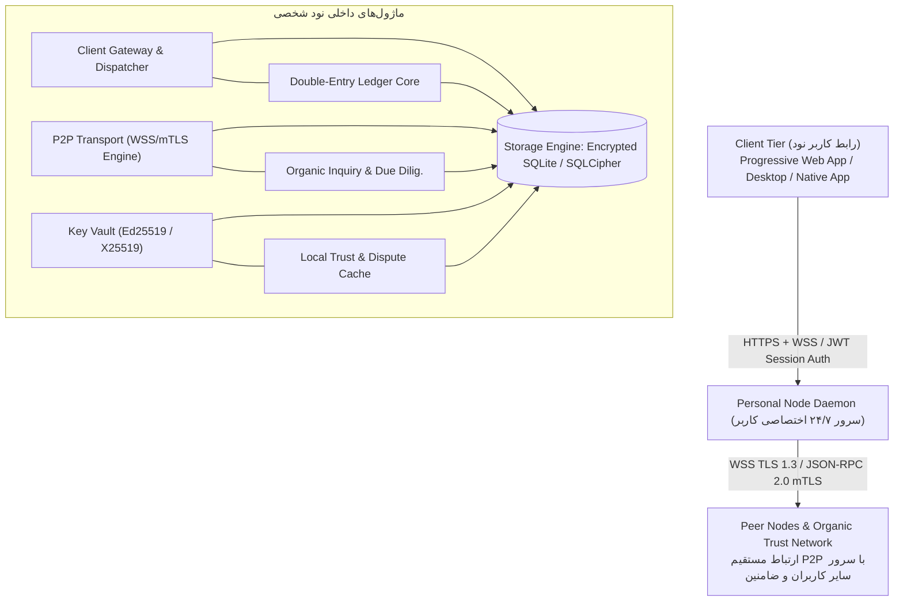
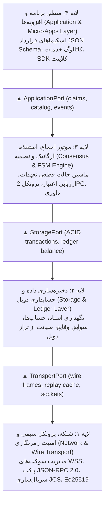
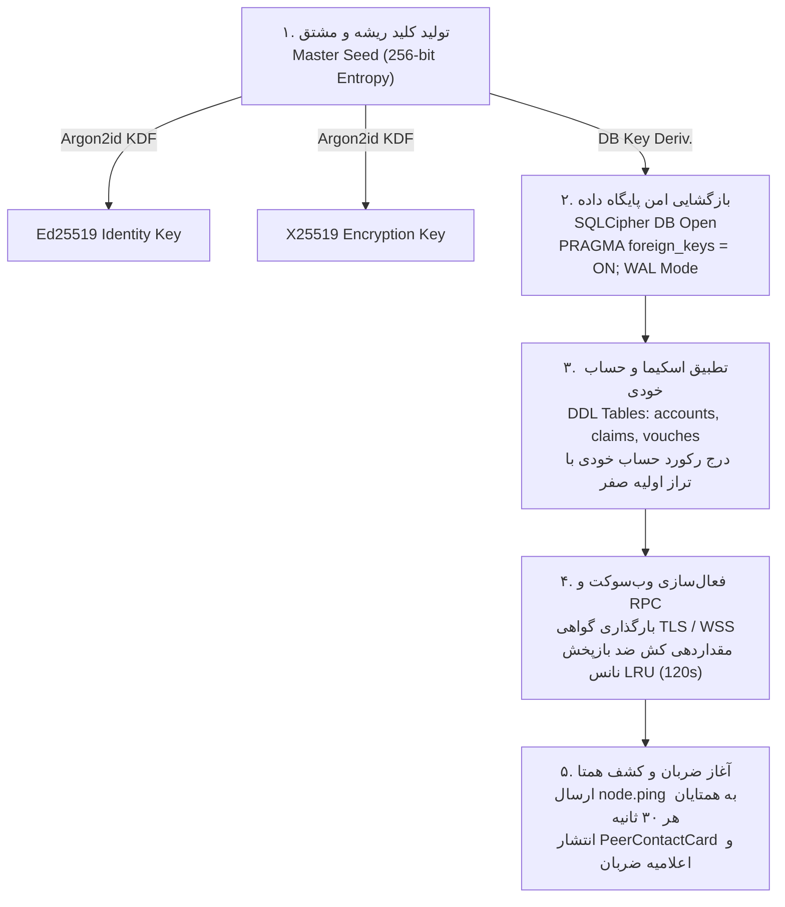
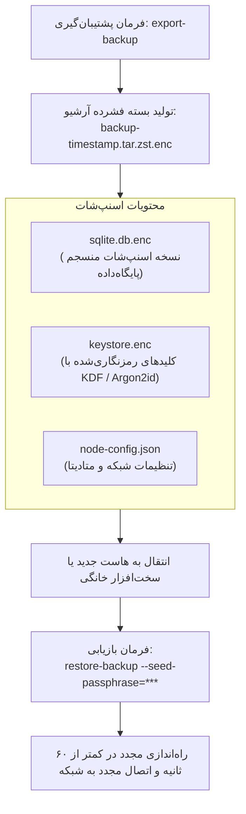
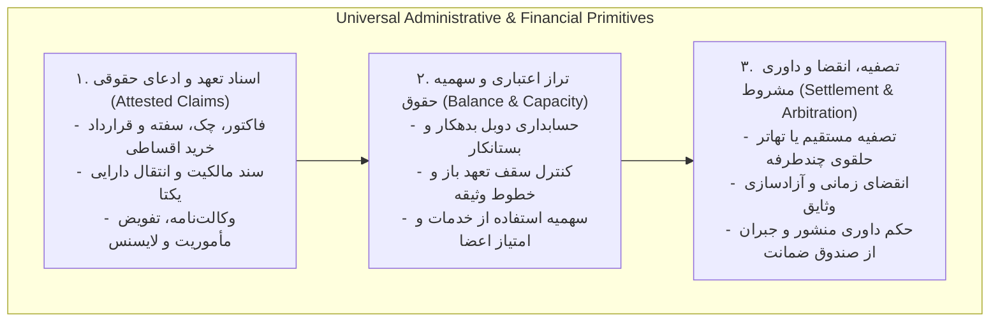
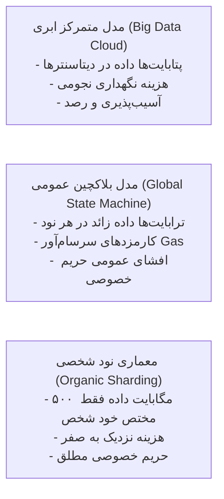
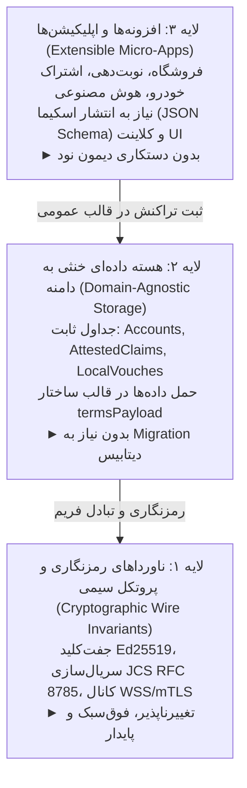

# بخش ۱: نمای کلی معماری، توپولوژی نودها، لایه‌بندی ماژولار و چرخه حیات (System Overview & Topology)

> **وضعیت سند:** استاندارد معماری مرجع (Normative Architecture Specification)  
> **انطباق زبانی:** این سند و تمام اسناد تابعه به طور دقیق از کلیدواژه‌های هنجاری **RFC 2119** و **RFC 8174** (مانند **باید / MUST**، **نباید / MUST NOT**، **الزامی است / REQUIRED**، **توصیه می‌شود / SHOULD** و **مجاز است / MAY**) پیروی می‌کنند.

---

## ۱. مدل منطقی و توپولوژی شبکه (Logical Topology & Node Roles)

شبکه از نودهای نرم‌افزاری مستقل، خوداتکا و دائم‌البیدار (`PersonalNode Daemon`) تشکیل شده است. هر شخص، کسب‌وکار، تعاونی یا حکومت دیجیتال دارای یک نمونه (Instance) اختصاصی ۲۴/۷ است که وظیفه اجرای تراکنش‌ها، ذخیره‌سازی محلی ایزوله، اعتبارسنجی ارگانیک و ایفای نقش شاهد را بر عهده دارد.

### اصول مهندسی جریان داده و الزامات رفتاری:
1. **استقلال عملیاتی ۲۴/۷ (MUST):** نود **باید** به عنوان یک سرویس پس‌زمینه پایدار (Daemon) با قابلیت پاسخ‌گویی دائمی روی سرور یا رایانه خانگی اجرا شود. خاموش بودن دستگاه کلاینت کاربر (تلفن همراه یا مرورگر) **نباید** مانع از دریافت اسناد تعهد، همگام‌سازی، یا پاسخ‌دهی به استعلام‌های ضامنین در شبکه شود.
2. **قانون دروازه واحد اعتبارسنجی (Single Point of Entry - MUST):** تمامی پیام‌ها، اسناد ادعا، استعلام‌های اعتباری و کاتالوگ‌های کالای خارجی **باید** مستقیماً توسط دیمون نود دریافت و اعتبارسنجی رمزنگاری شوند. هیچ کلاینتی **مجاز نیست** اسناد تاییدنشده را مستقیماً از منابع ناشناس خارجی بدون وساطت دیمون خود بپذیرد.
3. **ارتباط مستقیم سرتاسری (End-to-End P2P - MUST):** ارتباطات بین نودها **باید** به صورت نقطه-به-نقطه روی پروتکل ایمن رمزنگاری‌شده (WSS / TLS 1.3) با امضای دیجیتال Ed25519 بر تمام بسته‌ها برقرار گردد و هیچ هاب مرکزی پردازش‌کننده مجاز نیست.

---

## ۲. تفکیک ۴ لایه ماژولار معماری (The 4 Decoupled Architectural Layers)

برای تحقق اصل مقیاس‌پذیری آینده‌نگر (Future-Proof Scalability)، معماری نود به چهار لایه کاملاً مجزا با مرزبندی‌های صریح انتزاعی تقسیم شده است. هیچ لایه‌ای حق دخالت در جزئیات پیاده‌سازی لایه زیرین یا زبرین خود را ندارد:

### قراردادهای واسط بین لایه‌ها (Layer Interface Contracts):
- **رابط لایه انتقال (`TransportPort`):** لایه اجماع بدون درگیری با بایت‌های TCP/WSS، تنها متدهای `sendRpc(peerId, envelope)` و رویدادهای `onMessage(envelope)` را فراخوانی می‌کند.
- **رابط لایه ذخیره‌سازی (`StoragePort`):** لایه اجماع از طریق توابع انتزاعی مانند `getAccount(pubKey)`، `saveClaim(claim)` و `transactSettlement(tx)` به پایگاه‌داده دسترسی دارد و هیچ کوئری مستقیم SQL در منطق اجماع نوشته نمی‌شود. این امر اجازه می‌دهد پایگاه داده بدون تغییر در منطق اجماع، از SQLite به PostgreSQL یا هر موتور دیگر مهاجرت کند.
- **رابط لایه کاربرد (`ApplicationPort`):** افزونه‌های کسب‌وکار تنها با ساختار `termsPayload` و ۴ متد فراگیر SDK ارتباط دارند و هرگز به توابع داخلی رمزنگاری، امضای دیسک، یا جداول خام SQL دسترسی مستقیم ندارند.

---

## ۳. چرخه حیات و راه‌اندازی گام‌به‌گام نود (Bootstrapping & Node Lifecycle)

هر پیاده‌سازی مستقل نود **باید** فرآیند بوت اولیه و چرخه حیات زیر را به طور دقیق اجرا نماید:

### الگوریتم تولید کلید و بازگشایی دیتابیس (Deterministic Key Derivation):
1. کاربر یک عبارت بازیابی ۱۲ یا ۲۴ کلمه‌ای (BIP-39 Mnemonic) یا ۳۲ بایت آنتروپی تصادفی فراهم می‌کند.
2. با استفاده از الگوریتم **Argon2id** (با پارامترهای: `time_cost=3`, `memory_cost=65536 KiB`, `parallelism=4`):
   - ۳۲ بایت اول: کلید خصوصی هسته Ed25519 جهت هویت و امضا.
   - ۳۲ بایت دوم: کلید رمزنگاری محلی پایگاه‌داده SQLCipher (`PRAGMA key`).
   - ۳۲ بایت سوم: کلید تبادل نشست متقارن X25519.
3. متغیرهای کلید خصوصی در حافظه ایمن با قابلیت قفل رم (`mlock`) نگهداری شده و در صورت خاتمه فرآیند (SIGINT/SIGTERM) بلافاصله با صفرهای بایت رونویسی (Zeroize) می‌شوند.

---

## ۲. مدل امنیت و ایزولاسیون زیرساخت میزبانی (Host Isolation & Zero-Knowledge)

برای تضمین عدم وابستگی به ارائه‌دهنده سرویس (Vendor Lock-in) و صیانت از محرمانگی داده‌ها در برابر مدیران سرور ابری، سازوکار چندلایه‌ای زیر اعمال می‌شود:

| لایه امنیتی | تکنولوژی / متدولوژی | کارکرد مهندسی |
| :--- | :--- | :--- |
| **ایزولاسیون پردازش** | OCI Container (Docker / Podman) | اجرای ایزوله نرم‌افزار نود در محیطی با حداقل دسترسی (Rootless Container). |
| **رمزنگاری داده در حالت سکون** | SQLCipher (AES-256-CBC) | رمزنگاری کل پایگاه‌داده دیسک با کلید مشتق‌شده از Master Seed کاربر. |
| **گاوصندوق کلیدها** | Key Vault Memory Locking (`mlock`) | نگهداری کلیدهای امضا (Ed25519) در حافظه RAM قفل‌شده با صفرسازی خودکار در زمان خروج. |
| **محرمانگی ارتباطات** | mTLS با گواهی‌های خودامضا | احراز هویت دوجانبه در سطح لایه انتقال بر پایه کلید عمومی نود (`node_pubkey`). |

### مدل تهدید میزبان (Threat Model Against Cloud Host):
- ارائه‌دهنده میزبانی صرفاً پهنای باند و منابع پردازشی خام را تأمین می‌کند.
- حتی با دسترسی کامل Root به سیستم‌عامل والد، به دلیل رمزنگاری دیسک (SQLCipher) و انتقال رمزهای عبور تنها در حافظه ناپایدار (RAM) تحت حفاظت نشست کاربر، میزبان توانایی رمزگشایی پایگاه‌داده یا استخراج کلیدهای خصوصی را ندارد.

---

## ۳. مهاجرت آنی و بازیابی از فاجعه (Portability & Disaster Recovery)

پروتکل نود شامل مشخصه رسمی پشتیبان‌گیری استاندارد `NodeSnapshot` است:

### تضمین تداوم سرویس:
- تغییر آدرس IP یا ارائه‌دهنده VPS تأثیری در شناسه شبکه ندارد؛ هویت نود وابسته به کلید عمومی ثابت (`node_pubkey`) است که در شبکه از طریق اعلامیه امضاشده (`NodeHeartbeatAnnouncement`) به‌روزرسانی می‌شود.

---

## ۴. مشخصات پروفایل‌های استقرار سخت‌افزاری (Hardware Profiles)

| پارامتر سخت‌افزاری | پروفایل پایه (Micro Node) | پروفایل تجاری (Merchant Node) | پروفایل شاهد متراکم (Heavy Witness Node) |
| :--- | :--- | :--- | :--- |
| **جامعه هدف** | کاربران عادی و مصرف‌کنندگان | اصناف، فروشگاه‌ها و بازرگانان | نودهای با رتبه اعتبار بالا و کارگزاران داوری |
| **حافظه رم (RAM)** | ۲۵۶ تا ۵۱۲ مگابایت | ۱ تا ۲ گیگابایت | ۲ تا ۴ گیگابایت |
| **توان پردازنده (vCPU)** | ۰.۵ تا ۱ هسته | ۱ تا ۲ هسته | ۲ تا ۴ هسته |
| **فضای دیسک (SSD/NVMe)**| ۱۰ گیگابایت | ۵۰ گیگابایت | ۱۰۰ گیگابایت |
| **ظرفیت تراکنش بر ثانیه** | ۵ تا ۱۰ TPS | ۵۰ تا ۱۰۰ TPS | ۲۰۰+ TPS |
| **پروتکل ارتباطی پیش‌فرض** | HTTP/2 + WebSocket | HTTP/2 + WebSocket | gRPC / JSON-RPC روی mTLS سریع |

---

## ۵. موتور فراگیر اداری-مالی (Universal Administrative-Financial Engine)

برای برآورده‌سازی تمامی نیازهای مالی و حقوقی افراد بدون تورم معماری، سیستم به جای توسعه ده‌ها ماژول متفرقه، منطق اداری را به عنوان یک لایه خنثی (Domain-Agnostic Core) بر روی ۳ سنگ‌بنا پیاده‌سازی می‌کند:

با این طراحی، نود شخصی به جامع‌ترین پلتفرم اداری و مالی تبدیل می‌شود، در حالی که پایگاه‌داده آن همچنان چند جدول سبک SQLite و منطق آن چند گذار ماشین حالت متناهی باقی می‌ماند.

---

## ۶. محو مسئله «کلان‌داده» با شاردینگ طبیعی مبتنی بر هویت (Organic Sharding & Dissolution of Big Data)

دیدگاه سنتی در دنیای رایانش ابری و بلاکچین بر پایه یک پیش‌فرض پرهزینه شکل گرفته است:
1. **در سیستم‌های ابری متمرکز (بانک‌ها، آمازون، شبکه‌های اجتماعی):** داده‌های صدها میلیون کاربر در یک سرور مرکزی یا پایگاه‌داده توزیع‌شده غول‌آسا تجمیع می‌شود. در نتیجه، بحرانی به نام **«کلان‌داده (Big Data)»** به وجود می‌آید که مهار آن نیازمند خوشه‌های صدها سروری (Hadoop/Kafka)، دیتاسنترهای مگاواتی و زیرساخت‌های چند میلیارد دلاری است.
2. **در بلاکچین‌های عمومی (اتریوم، سولانا و بیت‌کوین):** هر نود در سراسر دنیا مجبور است **تمام تراکنش‌های تمام افراد کره زمین** را ذخیره و اجرا کند (معضل تورم تاریخچه و State Bloat). این امر حجم پایگاه داده هر نود را به چندین ترابایت می‌رساند.

### ۶.۱. واقعیت مقیاس انسانی و شاردینگ طبیعی (Natural Sharding by Identity)
در این معماری، هر انسان، شرکت یا پزشک **صرفاً داده‌های تراکنش‌ها، تعهدات و تاییدیه‌هایی را نگهداری می‌کند که خود یک طرف آن است**:
- **محاسبه حجم واقعی در مقیاس عمر انسان:**
  - یک فرد بسیار فعال یا یک فروشگاه متوسط، روزانه بین ۱۰ تا ۵۰ تراکنش انجام می‌دهد؛ یعنی حدود ۱۵,۰۰۰ تراکنش در سال.
  - حجم ذخیره‌سازی ۱۵,۰۰۰ سند ساختاریافته در SQLite با فشرده‌سازی استاندارد، تنها **حدود ۵ تا ۱۰ مگابایت** است.
  - کل سوابق مالی، قراردادها، پیام‌ها و تاییدیه‌های ۵۰ سال زندگی یک انسان، به زحمت به **۳۰۰ تا ۵۰۰ مگابایت** می‌رسد!
  - این حجم به راحتی روی یک حافظه فلش ارزان‌قیمت، یک تلفن همراه ساده یا یک رزبری‌پای ۳۰ دلاری با امنیت کامل جا می‌گیرد.

### ۶.۲. دستاوردهای فنی شاردینگ طبیعی
1. **سرعت کوئری کمتر از ۱ میلی‌ثانیه:** جستجو در یک پایگاه‌داده محلی چند صد مگابایتی بر روی شاخص درخت B-Tree در SQLite روی حافظه SSD، کمتر از ۱ میلی‌ثانیه زمان می‌برد؛ بدون تاخیر شبکه، بدون قفل‌های توزیع‌شده و بدون خطای تایم‌اوت.
2. **مقیاس‌پذیری افقی بی‌نهایت (Infinite Horizontal Scalability):** اگر جمعیت زمین از ۸ میلیارد به ۲۰ میلیارد نفر هم برسد، نیازی به ارتقای هیچ سرور مرکزی نیست؛ زیرا با تولد هر انسان، یک نود شخصی جدید با حافظه سبک خودش متولد می‌شود. شبکه به طور طبیعی به تعداد انسان‌ها شارد (قطعه‌بندی) شده است.
3. **جستجوی متن کامل محلی (Local FTS5 Search):** کاربر می‌تواند در کسری از ثانیه در میان تمام فاکتورها، پیام‌ها و قراردادهای ۵ سال گذشته خود جستجوی متنی انجام دهد، بدون اینکه داده‌ای به سرورهای بیگ‌تک فرستاده شود.
4. **حق فراموشی و حاکمیت داده (GDPR by Design):** داده‌های کاربر روی سرور دیگری وجود ندارد که نیاز به درخواست حذف یا نگرانی از درز اطلاعات باشد؛ مالکیت داده ۱۰۰٪ واقعی و محلی است.

---

## ۷. اصل مصونیت از بازمعماری زیرساخت با توسعه شبکه (The Zero-Infrastructure-Redesign Principle)

یکی از چالش‌های بنیادین سیستم‌های توزیع‌شده، نیاز مداوم به بازمعماری دیتابیس‌ها، ارتقای سرورها (Hard Fork) و تغییر پروتکل هسته با ورود نیازمندی‌ها و کسب‌وکارهای جدید است. این معماری تضمین می‌کند که **توسعه مقیاس شبکه و تنوع خدمات، هرگز توسعه‌دهندگان را نیازمند بازطراحی هسته نود نمی‌سازد**:

### دلایل فنی عدم نیاز به معماری مجدد:
1. **اسناد چندریختی و کپسوله‌سازی کامل (Polymorphic Self-Describing Claims):** هسته نود هیچ فرقی بین یک «فاکتور خرید نان»، «قرارداد اجاره آپارتمان»، «رزرو نوبت پزشک» یا «مجوز دسترسی به هوش مصنوعی» قائل نیست؛ همه آن‌ها یک سند `AttestedClaim` با امضای طرفین و یک شیء ساختاریافته `termsPayload` هستند.
2. **پروتکل باز مذاکره قابلیت‌ها (Capability Negotiation Handshake):** در زمان اتصال دو نود از طریق `node.handshake`، نودها فهرست افزونه‌های فعال خود را اعلام می‌کنند. اگر نود مقصد افزونه خاصی را نشناسد، تراکنش پایه تعهد همچنان در لایه عمومی نود با صحت کامل ثبت و تسویه می‌شود.
3. **تراکنش‌های کاملاً محلی بدون کووروم سراسری:** هیچ استخر تراکنش مشترک (Mempool) یا سد اجماع عمومی وجود ندارد که با افزایش تراکنش‌های جهان دچار ترافیک یا گلوگاه شود.

---

## ۸. راهنمای مدل معنایی برای هوش مصنوعی (AI Comprehension & Machine Semantics)

این بخش برای سیستم‌های استدلال خودکار و هوش مصنوعی تدوین شده است تا مدل‌های زبانی بتوانند سیستم را بدون سوءتعبیر یا فرضیات اشتباه بازتولید نمایند:

### ۸.۱. اصول منطقی سیستم (First-Principles Logic):
- **اصل قطعیت هویت:** هر نهاد در شبکه انحصاراً با یک کلید عمومی Ed25519 (رشته ۶۴ کاراکتری هگز) شناخته می‌شود. هیچ رکورد کاربری متمرکز وجود ندارد.
- **اصل بسته خوداتکا (Self-Contained Authenticity):** هر سند تعهد و هر فریم شبکه حاوی تمام شواهد، امضاها و داده‌های لازم برای اثبات حقانیت خود در دادگاه یا داور مستقل است.
- **اصل مصونیت از تراز منفی بدون اعتبار:** هیچ حسابی نمی‌تواند بیش از سقف تضمین‌شده توسط ضامنین در `local_vouches` سند تعهد بدهی صادر کند.

### ۸.۲. ماتریس ناورداهای سیستم (System Invariants Matrix):
- **ناوردای ۱ (Conservation of Debt):** $\forall c \in \text{Claims}: \text{Debt}(c) = \text{Credit}(c)$ — هر بدهی همواره معادل با یک طلب متقارن در حسابی دیگر است.
- **ناوردای ۲ (No Single-Sign Obligation):** برای انتقال تعهد به وضعیت `COMMITTED`، وجود دو امضای ریاضی معتبر (بدهکار و بستانکار) الزامی قطعی است.
- **ناوردای ۳ (Strict Timestamp Bounding):** هر بسته سیمی که انحراف زمانی ساعت آن فراتر از ۱۲۰ ثانیه باشد، فوراً توسط ماشین پردازش رد می‌شود.

