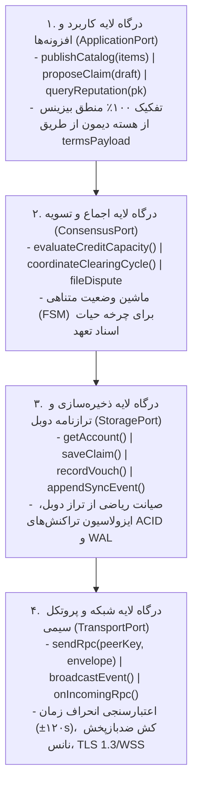

# بخش ۲: ساختار نرم‌افزار نود، مدل داده، درگاه‌های انتزاعی و اسکیمای ذخیره‌سازی محلی (Node Architecture & Storage Schema)

> **وضعیت سند:** استاندارد پیاده‌سازی مرجع (Normative Implementation Specification)  
> **انطباق با استانداردهای وب:** RFC 2119, RFC 8174, RFC 8785 (JCS), RFC 8032 (Ed25519)

---

## ۱. پشته معماری لایه‌ای نود و درگاه‌های انتزاعی (Layered Architecture & Abstract Ports)

نود شخصی یک فرآیند دائم‌البیدار (Daemon) مبتنی بر معماری پاک (Clean Architecture / Hexagonal Ports & Adapters) است. برای اطمینان از اینکه هر توسعه‌دهنده بتواند یک لایه را بدون بازنویسی سایر لایه‌ها پیاده‌سازی یا تعویض کند (مثلاً جایگزینی SQLite با PostgreSQL یا تعویض WSS با QUIC)، ارتباطات بین لایه‌ها منحصراً از طریق ۴ درگاه انتزاعی (Abstract Ports) صورت می‌پذیرد:



### ۱.۱. تعریف تایپ‌های درگاه‌های انتزاعی در هسته نود:
```typescript
/**
 * درگاه انتزاعی شبکه و انتقال داده (TransportPort)
 */
export interface TransportPort {
  sendRpc<TReq, TRes>(targetPubKey: string, method: string, params: TReq): Promise<TRes>;
  broadcastEvent<TEvent>(event: string, payload: TEvent): Promise<void>;
  registerRpcHandler<TParams, TResult>(
    method: string, 
    handler: (senderPubKey: string, params: TParams) => Promise<TResult>
  ): void;
}

/**
 * درگاه انتزاعی ذخیره‌سازی و ترازنامه دوبل (StoragePort)
 */
export interface StoragePort {
  getAccount(pubKey: string): Promise<AccountRecord | null>;
  upsertAccount(account: AccountRecord): Promise<void>;
  getClaim(documentId: string): Promise<AttestedClaim | null>;
  saveClaim(claim: AttestedClaim): Promise<void>;
  updateClaimStatus(documentId: string, newStatus: ClaimStatus, actorSignature: string): Promise<void>;
  getActiveVouchesForSubject(subjectPubKey: string): Promise<LocalVouchRecord[]>;
  appendSyncEvent(eventType: string, entityId: string, payload: Record<string, any>): Promise<number>;
  getSyncEvents(fromSeq: number, limit: number): Promise<SyncEventRecord[]>;
  runInTransaction<T>(work: (trx: StoragePort) => Promise<T>): Promise<T>;
}
```

---

## ۲. فرمول‌های ریاضی محاسبه شناسه‌ها و هش بذر (Deterministic IDs & Seed Hashes)

برای دستیابی به قابلیت همکاری مستقل و عدم مغایرت داده‌ها میان زبان‌های مختلف، تولید شناسه‌های یکتا و مقادیر هش **باید** دقیقاً از فرمول‌های استاندارد زیر پیروی کند:

### ۲.۱. محاسبه هش بذر سند تعهد (`seed_hash`):
هش بذر برای متمایزسازی اسنادی با مبالغ و طرفین یکسان در زمان‌های متفاوت به کار می‌رود و مانع از حملات بازپخش سند می‌گردد:
$$\text{seed\_hash} = \text{SHA-256-HEX}(\text{debtorPubKey} \parallel \text{creditorPubKey} \parallel \text{createdAt} \parallel \text{nonce})$$
- `debtorPubKey`: رشته ۶۴ کاراکتری هگز کلید عمومی بدهکار.
- `creditorPubKey`: رشته ۶۴ کاراکتری هگز کلید عمومی بستانکار.
- `createdAt`: عدد صحیح زمان بر حسب میلی‌ثانیه UTC.
- `nonce`: شناسه یکتای تصادفی UUID v4.

### ۲.۲. محاسبه شناسه یکتای سند (`documentId`):
شناسه سند بر پایه ۳۲ کاراکتر اول هش SHA-256 پیش‌تصویر متعارف JCS پیش‌نویس سند ساخته می‌شود:
$$\text{DraftPreimage} = \text{JCS}(\{ \text{"amount"}: a, \text{"claimType"}: ct, \text{"creditorPubKey"}: cp, \text{"debtorPubKey"}: dp, \text{"description"}: d, \text{"dueTimestamp"}: dt, \text{"seedHash"}: sh, \text{"termsPayload"}: tp, \text{"unit"}: u \})$$
$$\text{documentId} = \text{"doc-"} + \text{SHA-256-HEX}(\text{DraftPreimage})[0..32]$$

---

## ۳. اسکیمای پایگاه‌داده رابطه‌ای رسمی و تریگرهای صیانت (Production SQLite Schema)

این اسکیما **باید** دقیقاً با نام ستون‌ها و قیود یکپارچگی زیر در دیتابیس محلی هر نود پیاده‌سازی شود:

```sql
-- پیکربندی اولیه موتور SQLite
PRAGMA foreign_keys = ON;
PRAGMA journal_mode = WAL;
PRAGMA synchronous = NORMAL;

-- ۱. جدول حساب‌ها و مخاطبان تجاری
CREATE TABLE IF NOT EXISTS accounts (
    node_pubkey TEXT PRIMARY KEY CHECK(length(node_pubkey) = 64),
    alias_name TEXT NOT NULL,
    trust_score REAL NOT NULL DEFAULT 0.0 CHECK(trust_score >= 0.0),
    endorsed_credit_limit REAL NOT NULL DEFAULT 0.0 CHECK(endorsed_credit_limit >= 0.0),
    active_debt_balance REAL NOT NULL DEFAULT 0.0 CHECK(active_debt_balance >= 0.0),
    active_credit_balance REAL NOT NULL DEFAULT 0.0 CHECK(active_credit_balance >= 0.0),
    status TEXT NOT NULL CHECK(status IN ('ACTIVE', 'SUSPENDED', 'DEFAULTED')) DEFAULT 'ACTIVE',
    created_at INTEGER NOT NULL,
    updated_at INTEGER NOT NULL
);

-- ۲. جدول اسناد تعهدات و ادعاهای حقوقی جهان‌شمول
CREATE TABLE IF NOT EXISTS attested_claims (
    document_id TEXT PRIMARY KEY,
    parent_claim_id TEXT REFERENCES attested_claims(document_id),
    claim_type TEXT NOT NULL CHECK(claim_type IN (
        'FINANCIAL_OBLIGATION',
        'ASSET_TITLE_TRANSFER',
        'AGENT_MANDATE',
        'SERVICE_CONTRACT',
        'LICENSING_PERMIT',
        'TIME_SLOT_RESERVATION',
        'QUALITY_ENDORSEMENT'
    )) DEFAULT 'FINANCIAL_OBLIGATION',
    debtor_pubkey TEXT NOT NULL REFERENCES accounts(node_pubkey),
    creditor_pubkey TEXT NOT NULL REFERENCES accounts(node_pubkey),
    amount REAL NOT NULL DEFAULT 0.0 CHECK(amount >= 0.0),
    unit TEXT NOT NULL DEFAULT 'ORGANIC_CREDIT',
    description TEXT NOT NULL,
    terms_payload_json TEXT NOT NULL DEFAULT '{}',
    due_timestamp INTEGER NOT NULL,
    status TEXT NOT NULL CHECK(status IN (
        'PROPOSED', 'CO_SIGNED', 'COMMITTED', 'CLEARING', 'SETTLED', 'DEFAULTED', 'CANCELLED', 'REJECTED'
    )),
    debtor_signature TEXT NOT NULL CHECK(length(debtor_signature) = 128),
    creditor_signature TEXT CHECK(creditor_signature IS NULL OR length(creditor_signature) = 128),
    seed_hash TEXT NOT NULL CHECK(length(seed_hash) = 64),
    created_at INTEGER NOT NULL,
    settled_at INTEGER
);

CREATE INDEX IF NOT EXISTS idx_claims_debtor ON attested_claims(debtor_pubkey, status);
CREATE INDEX IF NOT EXISTS idx_claims_creditor ON attested_claims(creditor_pubkey, status);
CREATE INDEX IF NOT EXISTS idx_claims_type ON attested_claims(claim_type, status);
CREATE INDEX IF NOT EXISTS idx_claims_due ON attested_claims(due_timestamp, status);

-- ۳. جدول ضمانت‌های محلی و خطوط اعتبار
CREATE TABLE IF NOT EXISTS local_vouches (
    vouch_id TEXT PRIMARY KEY,
    voucher_pubkey TEXT NOT NULL REFERENCES accounts(node_pubkey),
    subject_pubkey TEXT NOT NULL REFERENCES accounts(node_pubkey),
    guaranteed_credit_limit REAL NOT NULL CHECK(guaranteed_credit_limit >= 0.0),
    collateral_pledged REAL NOT NULL DEFAULT 0.0 CHECK(collateral_pledged >= 0.0),
    statement TEXT,
    voucher_signature TEXT NOT NULL CHECK(length(voucher_signature) = 128),
    created_at INTEGER NOT NULL
);

CREATE INDEX IF NOT EXISTS idx_vouches_subject ON local_vouches(subject_pubkey);
CREATE INDEX IF NOT EXISTS idx_vouches_voucher ON local_vouches(voucher_pubkey);

-- ۴. جدول آرشیو احکام حل اختلاف و داوری حاکمیتی
CREATE TABLE IF NOT EXISTS dispute_records (
    dispute_id TEXT PRIMARY KEY,
    document_id TEXT NOT NULL REFERENCES attested_claims(document_id),
    arbitrator_pubkey TEXT NOT NULL CHECK(length(arbitrator_pubkey) = 64),
    verdict TEXT NOT NULL CHECK(verdict IN ('DEFAULT_CONFIRMED', 'EXTENSION_GRANTED', 'SETTLEMENT_ORDERED', 'CLAIM_DISMISSED')),
    penalty_details_json TEXT NOT NULL DEFAULT '{}',
    arbitrator_signature TEXT NOT NULL CHECK(length(arbitrator_signature) = 128),
    created_at INTEGER NOT NULL
);

-- ۵. جدول وقایع همگام‌سازی پس از قطعی ارتباط (State Sync Journal)
CREATE TABLE IF NOT EXISTS sync_events (
    event_seq INTEGER PRIMARY KEY AUTOINCREMENT,
    event_type TEXT NOT NULL CHECK(event_type IN (
        'CLAIM_PROPOSED',
        'CLAIM_COMMITTED',
        'CLAIM_CLEARING',
        'CLAIM_SETTLED',
        'CLAIM_DEFAULTED',
        'VOUCH_CREATED',
        'DISPUTE_FILED'
    )),
    entity_id TEXT NOT NULL,
    payload_json TEXT NOT NULL,
    created_at INTEGER NOT NULL
);

CREATE INDEX IF NOT EXISTS idx_sync_events_seq ON sync_events(event_seq);

-- ۶. تریگر صیانت از تراز دوبل و موازنه ترازنامه (Double-Entry Invariant Trigger)
CREATE TRIGGER IF NOT EXISTS trg_update_account_balances_on_commit
AFTER UPDATE OF status ON attested_claims
FOR EACH ROW
WHEN NEW.status = 'COMMITTED' AND OLD.status != 'COMMITTED' AND NEW.amount > 0
BEGIN
    UPDATE accounts 
    SET active_debt_balance = active_debt_balance + NEW.amount,
        updated_at = strftime('%s', 'now') * 1000
    WHERE node_pubkey = NEW.debtor_pubkey;

    UPDATE accounts 
    SET active_credit_balance = active_credit_balance + NEW.amount,
        updated_at = strftime('%s', 'now') * 1000
    WHERE node_pubkey = NEW.creditor_pubkey;
END;

CREATE TRIGGER IF NOT EXISTS trg_update_account_balances_on_settle
AFTER UPDATE OF status ON attested_claims
FOR EACH ROW
WHEN NEW.status = 'SETTLED' AND OLD.status != 'SETTLED' AND NEW.amount > 0
BEGIN
    UPDATE accounts 
    SET active_debt_balance = active_debt_balance - NEW.amount,
        updated_at = strftime('%s', 'now') * 1000
    WHERE node_pubkey = NEW.debtor_pubkey;

    UPDATE accounts 
    SET active_credit_balance = active_credit_balance - NEW.amount,
        updated_at = strftime('%s', 'now') * 1000
    WHERE node_pubkey = NEW.creditor_pubkey;
END;
```

---

## ۴. مشخصات پیام‌های پروتکل سیمی و استعلام همگام‌سازی (Wire Sync RPCs)

### ۴.۱. متد بازیابی وقایع معوق (`sync.pullEvents`):
زمانی که نود پس از قطعی موقت به شبکه بازمی‌گردد، با فراخوانی این متد وقایع جدید را از آخرین توالی دریافتی بازیابی می‌کند:

- **درخواست (Request Frame):**
```json
{
  "jsonrpc": "2.0",
  "id": "sync-req-101",
  "method": "sync.pullEvents",
  "params": {
    "fromSequence": 14200,
    "limit": 50
  },
  "auth": {
    "senderPubKey": "d75a980182b10ab7d54bfed3c964073a0ee172f3daa62325af021a68f707511a",
    "recipientPubKey": "771a980182b10ab7d54bfed3c964073a0ee172f3daa62325af021a68f707599b",
    "timestamp": 1742415000000,
    "nonce": "99fa7712-4011-4882-901a-cb88019ab712",
    "signature": "4172f87a55259e88cbfeecdc33a3ce4ffca5f7a22e8bb332f14aa7c5c0cbe27fa5e64817d7b69a1ec098bbd4cfa12ef5b1e626e257b567d169ceeaec2c5f1101"
  }
}
```

- **پاسخ موفق (Response Result):**
```json
{
  "jsonrpc": "2.0",
  "id": "sync-req-101",
  "result": {
    "events": [
      {
        "eventSeq": 14201,
        "eventType": "CLAIM_COMMITTED",
        "entityId": "doc-9f201a4e8b2fe901c80f68285ffcb610",
        "payload": {
          "documentId": "doc-9f201a4e8b2fe901c80f68285ffcb610",
          "debtorPubKey": "d75a980182b10ab7d54bfed3c964073a0ee172f3daa62325af021a68f707511a",
          "creditorPubKey": "771a980182b10ab7d54bfed3c964073a0ee172f3daa62325af021a68f707599b",
          "amount": 420.00,
          "status": "COMMITTED",
          "creditorSignature": "4172f87a55259e88cbfeecdc33a3ce4ffca5f7a22e8bb332f14aa7c5c0cbe27fa5e64817d7b69a1ec098bbd4cfa12ef5b1e626e257b567d169ceeaec2c5f1101"
        },
        "createdAt": 1742415005000
      }
    ],
    "hasMore": false,
    "latestSequence": 14201
  }
}
```

---

## ۵. کاتالوگ جامع کدهای خطای پروتکل (Deterministic Error Matrix)

کلیه پاسخ‌های خطا **باید** ساختار استاندارد زیر را داشته باشند:
```typescript
interface JsonRpcErrorEnvelope {
  jsonrpc: "2.0";
  id: string | null;
  error: {
    code: number;
    message: string;
    data: {
      errorCode: string;
      messageFa: string;
      details?: Record<string, any>;
    };
  };
}
```

| کد عددی | شناسه متنی ماشین‌خوان | عنوان خطا | اقدام الزامی گیرنده |
| :---: | :--- | :--- | :--- |
| **`-32700`** | `PARSE_ERROR` | بسته JSON ناقص یا نامعتبر است. | فریم رد شده و سوکت قطع نمی‌شود. |
| **`-32600`** | `INVALID_REQUEST` | فاقد ساختار پاکت احراز هویت `auth`. | اصلاح ساختار بسته در کلاینت فرستنده. |
| **`-32601`** | `METHOD_NOT_FOUND` | متد درخواستی وجود ندارد یا ماژول آن غیرفعال است. | استعلام `node.handshake` برای بررسی ماژول‌های فعال. |
| **`-32602`** | `INVALID_PARAMS` | عدم تطابق ورودی متد با اسکیمای تعیین‌شده. | اعتبارسنجی با اسکیما پیش از ارسال مجدد. |
| **`-32603`** | `INTERNAL_ERROR` | خطای داخلی دیتابیس یا کرش لایه ذخیره‌سازی. | ثبت لاگ و ارسال مجدد پس از تأخیر معقول. |
| **`-32001`** | `ERR_INVALID_SIGNATURE` | امضای Ed25519 با داده متعارف ارسالی همخوانی ندارد. | توقف فوری؛ احتمال دستکاری در مسیر. |
| **`-32002`** | `ERR_TIMESTAMP_DRIFT` | انحراف ساعت نود با ساعت جهانی بیش از ۱۲۰ ثانیه است. | همگام‌سازی سرور با پروتکل NTP. |
| **`-32003`** | `ERR_REPLAY_NONCE` | نانس ارسالی پیش‌تر در پنجره زمانی مصرف شده است. | درخواست بازپخش بوده و مسدود می‌شود. |
| **`-32004`** | `ERR_OVER_CREDIT_LIMIT` | مبلغ تعهد از سقف اعتبار تاییدشده ضامنین فراتر است. | رد فاکتور نسیه یا درخواست واریز وثیقه. |
| **`-32005`** | `ERR_INQUIRY_TIMEOUT` | ضامنین در بازه زمانی تعیین‌شده پاسخ ندادند. | معرفی ضامنین آنلاین دیگر توسط بدهکار. |
| **`-32006`** | `ERR_ACCOUNT_FROZEN` | حساب مخاطب به دلیل حکم داوری یا تعویق بدهی معلق است. | قطع کلیه مبادلات مالی با نود متخلف. |
| **`-32007`** | `ERR_UNAUTHORIZED_AGENT` | کلید فرستنده فاقد گواهی مأموریت معتبر از سوی حاکم است. | رد صلاحیت کارگزار مربوطه. |
| **`-32008`** | `ERR_DUPLICATE_DOCUMENT` | سندی با این `document_id` پیش‌تر ثبت شده است. | نادیده‌گرفتن عملیات تکراری. |
| **`-32009`** | `ERR_CYCLE_ABORTED` | حلقه تصفیه به دلیل تغییر مانده یکی از اعضا لغو شد. | آزادسازی قفل `CLEARING` و بازگشت به `COMMITTED`. |
| **`-32010`** | `ERR_INVALID_STATE_TRANSITION` | گذار وضعیت نامعتبر در ماشین حالت تعهد. | بازبینی قوانین ماشین وضعیت (بخش ۰۴ و ۰۹). |
| **`-32011`** | `ERR_DATABASE_LOCKED` | خطای مشغولی دیتابیس SQLite در نوشتن همزمان. | تلاش مجدد با عقب‌نشینی نمایی با جیتر (Exponential Backoff). |
| **`-32012`** | `ERR_INSUFFICIENT_VOUCH_CAPACITY` | ظرفیت تضمین آزاد ضامن برای پوشش این بدهی کافی نیست. | کاهش مبلغ تعهد یا اخذ ضمانت‌نامه تکمیلی. |
| **`-32013`** | `ERR_EXPIRED_MANDATE` | تاریخ اعتبار گواهی مأموریت کارگزار سپری شده است. | تجدید گواهی توسط حاکم دیجیتال مربوطه. |
| **`-32014`** | `ERR_DOCUMENT_NOT_FOUND` | سندی با شناسه استعلام‌شده در دیتابیس یافت نشد. | اطمینان از صحت `document_id`. |
| **`-32015`** | `ERR_UNSUPPORTED_MODULE` | ماژول مرتبط با این عملیات در پیکربندی غیرفعال است. | فعال‌سازی ماژول در `node-config.json`. |

