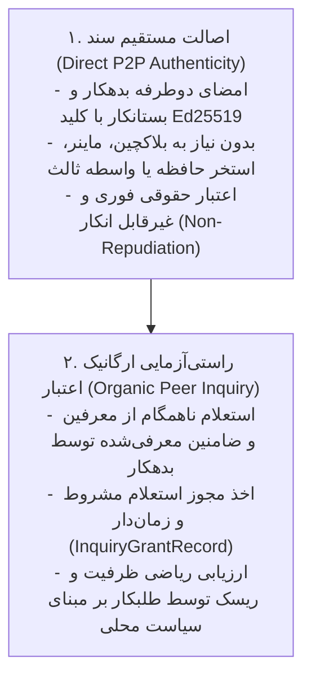
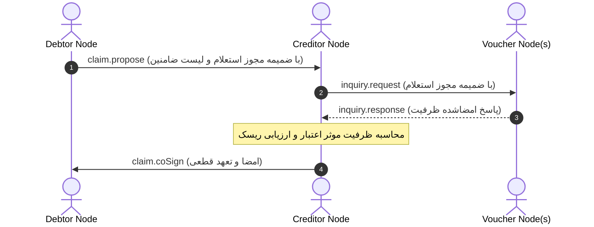

# بخش ۳: اصالت مستقیم اسناد و پروتکل استعلام ارگانیک اعتبار (Direct Authenticity & Organic Peer Inquiry)

> **وضعیت سند:** استاندارد پیاده‌سازی مرجع (Normative Implementation Specification)  
> **انطباق با استانداردهای وب:** RFC 2119, RFC 8174, RFC 8785 (JCS), RFC 8032 (Ed25519)

---

## ۱. تفکیک بنیادین دو مقوله مستقل: «اصالت سند» در برابر «راستی‌آزمایی اعتبار»

سیستم‌های توزیع‌شده سنتی غالباً به اشتباه دو مسئله مستقل را در یک لایه اجماع ترکیب می‌کردند:
1. **اصالت و قطعیت حقوقی سند (Document Authenticity):** آیا این تعهدنامه مستند، غیرقابل انکار و مصون از تحریف است؟
2. **اعتبارسنجی و پیشگیری از نکول (Credit Risk & Due Diligence):** آیا صادرکننده سقف اعتبار و خوش‌حسابی کافی برای اجرای تعهد را دارد؟

### اصول حاکم بر تفکیک لایه‌ها (Separation Invariants):
- **بند ۱.۱ (Self-Sufficiency):** اصالت هر سند تعهد (`AttestedClaim`) **باید** منحصراً با تبادل مستقیم امضای Ed25519 طرفین (بدهکار و بستانکار) تأیید شود. نودها **نباید** برای اثبات اصالت سند نیازمند گواه سوم‌شخص یا تاییدیه بلاکچین عمومی باشند.
- **بند ۱.۲ (Organic Inquiry):** سنجش ریسک اعتباری **باید** از طریق پروتکل استعلام همتا-به-همتا (`inquiry.request`) از ضامنین (`vouchers`) انجام گیرد. هر بازیگر با آزادی کامل و بر اساس سیاست مدیریت ریسک خود در مورد پذیرش تعهد تصمیم می‌گیرد.



---

## ۲. توالی پروتکل استعلام ارگانیک اعتبار (Wire Protocol Lifecycle)



### الزامات رفتاری طرفین (Normative Rules):
1. بدهکار **باید** در زمان ارسال پیش‌نویس تعهد نسیه، حداقل یک مجوز استعلام معتبر (`InquiryGrantRecord`) و فهرست کلید عمومی ضامنین خود را ارسال کند.
2. طلبکار **باید** صحت امضای بدهکار روی `InquiryGrantRecord` و عدم انقضای `validUntil` را پیش از ارسال استعلام راستی‌آزمایی نماید.
3. نود ضامن **نباید** به هیچ استعلامی بدون وجود `InquiryGrantRecord` معتبر پاسخ دهد. در صورت عدم تطابق یا انقضا، نود ضامن **باید** خطای `-32007` (`ERR_UNAUTHORIZED_AGENT`) بازگرداند.

---

## ۳. مشخصات سیمی پیام‌های پروتکل استعلام (JSON-RPC 2.0 Specifications)

### ۳.۱. ساختار مجوز استعلام مشروط (`InquiryGrantRecord`):
```typescript
export interface InquiryGrantRecord {
  grantId: string;
  subjectPubKey: string;      // کلید ۶۴ کاراکتری بدهکار (اعطاکننده مجوز)
  granteePubKey: string;      // کلید ۶۴ کاراکتری طلبکار (استعلام‌کننده مجاز)
  scope:                      // دامنه دسترسی دقیق
    | "CREDIT_CAPACITY_AND_STANDING"
    | "SETTLEMENT_HISTORY_RATIO"
    | "CITIZENSHIP_AND_POLITY_STATUS"
    | "SPECIFIC_COLLATERAL_HOLDING";
  contextReference?: string;  // شناسه سند یا فاکتور مرتبط
  validFrom: number;          // میلی‌ثانیه UTC
  validUntil: number;         // میلی‌ثانیه UTC
  subjectSignature: string;   // امضای Ed25519 روی پیش‌تصویر JCS این شیء بدون امضا
}
```

### ۳.۲. درخواست استعلام اعتبار (`inquiry.request`):
- **ساختار درخواست روی سیم:**
```json
{
  "jsonrpc": "2.0",
  "id": "inq-req-8801",
  "method": "inquiry.request",
  "params": {
    "subjectPubKey": "d75a980182b10ab7d54bfed3c964073a0ee172f3daa62325af021a68f707511a",
    "requestedCreditAmount": 450.00,
    "unit": "ORGANIC_CREDIT",
    "inquiryTimestamp": 1742415000000,
    "inquiryNonce": "d9812a01-44bb-4f90-8801-ffac0091aa01",
    "inquiryGrant": {
      "grantId": "grant-2026-991",
      "subjectPubKey": "d75a980182b10ab7d54bfed3c964073a0ee172f3daa62325af021a68f707511a",
      "granteePubKey": "771a980182b10ab7d54bfed3c964073a0ee172f3daa62325af021a68f707599b",
      "scope": "CREDIT_CAPACITY_AND_STANDING",
      "validFrom": 1742414000000,
      "validUntil": 1742500000000,
      "subjectSignature": "4172f87a55259e88cbfeecdc33a3ce4ffca5f7a22e8bb332f14aa7c5c0cbe27fa5e64817d7b69a1ec098bbd4cfa12ef5b1e626e257b567d169ceeaec2c5f1101"
    }
  },
  "auth": {
    "senderPubKey": "771a980182b10ab7d54bfed3c964073a0ee172f3daa62325af021a68f707599b",
    "recipientPubKey": "aa112233445566778899aabbccddeeff00112233445566778899aabbccddeeff",
    "timestamp": 1742415000000,
    "nonce": "c9a0f443-85b1-4f10-b992-cf109e992b11",
    "signature": "39e4a817d7b69a1ec098bbd4cfa12ef5b1e626e257b567d169ceeaec2c5f11014172f87a55259e88cbfeecdc33a3ce4ffca5f7a22e8bb332f14aa7c5c0cbe27f"
  }
}
```

### ۳.۳. پاسخ رسمی و امضاشده نود ضامن (`inquiry.response`):
- **ساختار پاسخ روی سیم:**
```json
{
  "jsonrpc": "2.0",
  "id": "inq-req-8801",
  "result": {
    "voucherPubKey": "aa112233445566778899aabbccddeeff00112233445566778899aabbccddeeff",
    "subjectPubKey": "d75a980182b10ab7d54bfed3c964073a0ee172f3daa62325af021a68f707511a",
    "guaranteedCreditLimit": 1000.00,
    "activeObligationsUnderVoucher": 200.00,
    "availableCapacity": 800.00,
    "historicalSettlementRatio": 0.985,
    "status": "IN_GOOD_STANDING",
    "validUntil": 1742500000000,
    "voucherSignature": "9941a87a55259e88cbfeecdc33a3ce4ffca5f7a22e8bb332f14aa7c5c0cbe27fa5e64817d7b69a1ec098bbd4cfa12ef5b1e626e257b567d169ceeaec2c5f2202"
  }
}
```

### ۳.۴. پیش‌تصویر امضای ضامن (Voucher Preimage Calculation):
امضای `voucherSignature` **باید** بر روی هش پیش‌تصویر متعارف JCS فیلدهای زیر تولید شود:
$$\text{Preimage} = \text{JCS}(\{ \text{"activeObligationsUnderVoucher"}: 200.00, \text{"availableCapacity"}: 800.00, \text{"guaranteedCreditLimit"}: 1000.00, \text{"historicalSettlementRatio"}: 0.985, \text{"status"}: \text{"IN\_GOOD\_STANDING"}, \text{"subjectPubKey"}: \text{"..."}, \text{"validUntil"}: 1742500000000, \text{"voucherPubKey"}: \text{"..."} \})$$
$$\text{voucherSignature} = \text{Ed25519-Sign}(\text{PrivateKey}_{\text{voucher}}, \text{SHA-256}(\text{Preimage}))$$

---

## ۴. الگوریتم قطعی ارزیابی سقف اعتبار و مسئولیت تضامنی (Deterministic Credit Assessment)

طلبکار هنگام دریافت پاسخ‌های استعلام، ظرفیت مؤثر اعتباری بدهکار را مطابق فرمول قطعی زیر ارزیابی می‌کند:

### ۴.۱. فرمول محاسبه ظرفیت مؤثر تضمین‌شده:
$$\text{EffectiveCapacity} = \sum_{v \in \mathcal{V}} \min\Big(\text{AvailableCapacity}(v), \text{CollateralPledged}(v) + \text{EndorsedLimit}(v)\Big)$$
که در آن $\mathcal{V}$ مجموعه ضامنین معتبر است که امضای آن‌ها در بازه زمانی `validUntil` تأیید شده و در وضعیت `IN_GOOD_STANDING` قرار دارند.

### ۴.۲. فرمول نسبت ریسک و تصمیم‌گیری نهایی:
$$\text{WeightedSettlementRatio} = \frac{\sum_{v \in \mathcal{V}} \text{HistoricalSettlementRatio}(v) \cdot \text{GuaranteedLimit}(v)}{\sum_{v \in \mathcal{V}} \text{GuaranteedLimit}(v)}$$

$$\text{AssessmentResult} = \begin{cases}
\text{ACCEPT\_FULL\_CREDIT} & \text{if } \text{EffectiveCapacity} \ge \text{ClaimAmount} \land \text{WeightedSettlementRatio} \ge 0.95 \\
\text{REQUIRE\_COLLATERAL} & \text{if } \text{EffectiveCapacity} \ge \text{ClaimAmount} \land \text{WeightedSettlementRatio} < 0.95 \\
\text{REJECT\_CREDIT} & \text{if } \text{EffectiveCapacity} < \text{ClaimAmount}
\end{cases}$$

---

## ۵. اصل مسئولیت تضامنی حقوقی ضامن (Voucher Legal Guarantee Invariant)

هر ضامنی که پاسخی با `voucherSignature` معتبر صادر می‌کند، به طور رسمی و قانونی ضمانت تضامنی بدهی‌های متعهد را تا سقف `availableCapacity` تعهد می‌نماید:
- اگر بدهکار در موعد مقرر سند را تسویه نکند (`DEFAULTED`)، طلبکار **می‌تواند** سند مطالبه خسارت (`FINANCIAL_OBLIGATION`) را مستقیماً علیه نود ضامن تا سقف تضمین‌شده صادر و در هیئت داوری مربوطه پیگیری کند.
- این ضمانت سبب می‌شود نودها هرگز بی‌دلیل یا بر اساس رابطه صوری اقدام به صدور سقف اعتبار نکنند؛ اعتبار در این شبکه دارای مسئولیت ملموس و ترازنامه متقارن است.