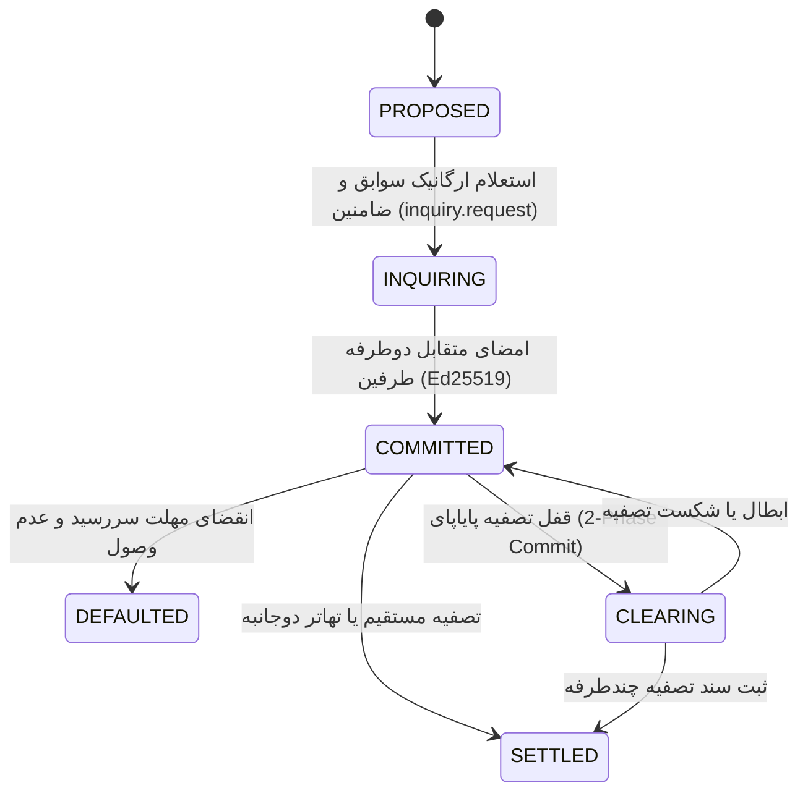
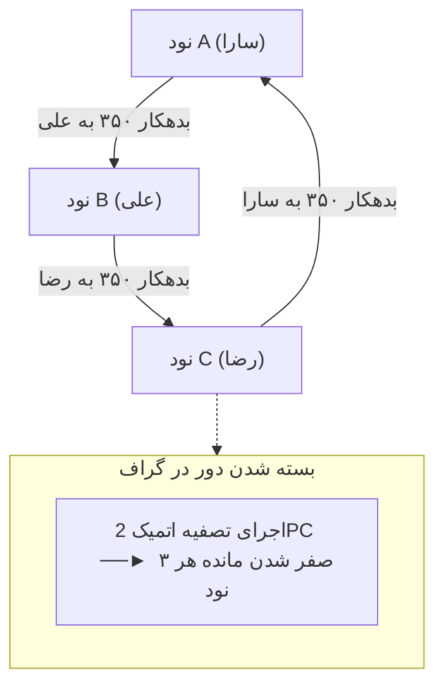
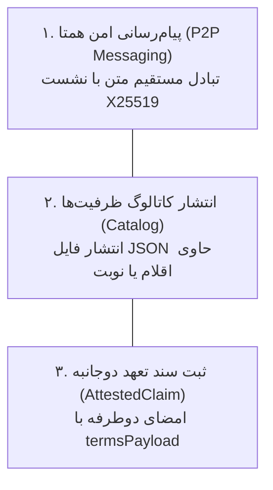

# بخش ۴: چرخه حیات تعهدات مالی، قراردادها و الگوریتم تصفیه پایاپای (Transaction Lifecycle & Clearing)

> **وضعیت سند:** استاندارد پیاده‌سازی مرجع (Normative Implementation Specification)  
> **انطباق با استانداردهای وب:** RFC 2119, RFC 8174, RFC 8785 (JCS), RFC 8032 (Ed25519)

---

## ۱. ماشین حالت رسمی اسناد و تعهدات (Universal Claim State Machine)

چرخه حیات کلیه اسناد (فاکتورهای مالی، انتقال مالکیت، مأموریت‌ها و قراردادهای خدمت) بر اساس یک ماشین حالت متناهی و قطعی (Deterministic FSM) مدیریت می‌شود. هرگونه تلاش برای اعمال گذار نامعتبر **باید** فوراً توسط دیمون نود متوقف شده و خطای استاندارد `-32010` (`ERR_INVALID_STATE_TRANSITION`) صادر گردد.



### جدول گذار وضعیت‌ها، شرایط اعتبارسنجی و کدهای خطا (State Invariants Matrix):

| وضعیت مبدأ | رویداد محرک | وضعیت مقصد | شروط و اقدامات لایه منطق | کد خطای شکست |
| :--- | :--- | :--- | :--- | :--- |
| **`PROPOSED`** | آغاز استعلام توسط دریافت‌کننده | `INQUIRING` | اعتبارسنجی `InquiryGrantRecord` و ارسال `inquiry.request`. | `-32007` |
| **`PROPOSED`** | لغو توسط صادرکننده | `CANCELLED` | پیش از امضای طرف مقابل و بدون تغییر در ترازنامه. | `-32010` |
| **`INQUIRING`** | تایید اعتبار و تبادل امضا | `COMMITTED` | درج قطعی سند با امضای Ed25519 هر دو نود و بروزرسانی بالانس. | `-32001` |
| **`INQUIRING`** | رد استعلام یا انصراف به دلیل ریسک | `REJECTED` | ابطال پیش‌نویس بدون اثر مالی بر حساب‌ها. | `-32004` |
| **`COMMITTED`** | پرداخت کامل یا تهاتر مستقیم | `SETTLED` | درج تاریخ تسویه و کاهش متقارن بدهی و طلب در ترازنامه دوبل. | `-32010` |
| **`COMMITTED`** | انقضای سررسید بدون تسویه | `DEFAULTED` | آغاز پنجره ۷۲ ساعته حل اختلاف یا رجوع به ضامنین تضامنی. | `-32006` |
| **`COMMITTED`** | آغاز تصفیه حلقوی 2PC | `CLEARING` | قفل موقت مبلغ گلوگاه $M_{\text{clear}}$ به مدت حداکثر ۶۰ ثانیه. | `-32009` |
| **`CLEARING`** | ابطال یا تایم‌اوت حلقه | `COMMITTED` | آزادسازی قفل مبلغ و بازگرداندن وضعیت سند به تعهد فعال. | `-32009` |
| **`CLEARING`** | ثبت قطعی سند تصفیه چندطرفه | `SETTLED` | اعمال سند تصفیه و کسر قطعی مبلغ از ترازنامه کلیه اعضای حلقه. | `-32001` |

---

## ۲. الگوریتم دو مرحله‌ای تصفیه پایاپای حلقوی (2-Phase Circular Debt Clearing)

تعهدات مالی میان فعالان شبکه تشکیل گراف جهت‌دار وزندار $G = (V, E)$ می‌دهند. الگوریتم تصفیه با حذف بدهی‌های متقابل، نیاز به جریان نقدینگی را برطرف می‌سازد.



### ۲.۱. فرمول محاسبه شناسه تصفیه و ممانعت از بن‌بست (Deadlock Invariants):
- **محاسبه شناسه یکتای تصفیه (`clearingId`):**
$$\text{clearingId} = \text{"clr-"} + \text{SHA-256-HEX}\big(\text{JCS}(\text{SortedCycleDocumentIds})\big)[0..32]$$
- **قانون تقدم حلقه‌ها (Deadlock Prevention Rule):** اگر سندی به طور همزمان در دو حلقه تصفیه کشف شود، همواره حلقه‌ای اولویت دارد که از نظر الفبایی `clearingId` کوچکتری دارد. حلقه دوم **باید** تا تعیین تکلیف حلقه اول منتظر بماند یا لغو گردد.

### ۲.۲. پیام‌های سیمی پروتکل تصفیه دو فازی (Wire 2PC RPCs):

#### ۱. پیام فاز آماده‌سازی (`clearing.prepare`):
```json
{
  "jsonrpc": "2.0",
  "id": "clr-prep-01",
  "method": "clearing.prepare",
  "params": {
    "clearingId": "clr-88a109fe2c1145ba010091aa447190ef",
    "documentId": "doc-9f201a4e8b2fe901c80f68285ffcb610",
    "bottleneckAmount": 350.00,
    "expiresAt": 1742415060000
  },
  "auth": {
    "senderPubKey": "aa112233...",
    "recipientPubKey": "bb223344...",
    "timestamp": 1742415000000,
    "nonce": "uuid-v4-nonce-01",
    "signature": "sig_ed25519_hex..."
  }
}
```

#### ۲. پیام فاز تأیید نهایی (`clearing.commit`):
```json
{
  "jsonrpc": "2.0",
  "id": "clr-commit-01",
  "method": "clearing.commit",
  "params": {
    "clearingRecord": {
      "clearingId": "clr-88a109fe2c1145ba010091aa447190ef",
      "timestamp": 1742415010000,
      "clearingAmount": 350.00,
      "unit": "ORGANIC_CREDIT",
      "cycleEdges": [
        {
          "documentId": "doc-9f201a4e8b2fe901c80f68285ffcb610",
          "debtorPubKey": "aa1122...",
          "creditorPubKey": "bb2233...",
          "originalAmount": 350.00,
          "remainingAmount": 0.00
        }
      ],
      "memberSignatures": [
        { "nodePubKey": "aa1122...", "signature": "sig_a_hex..." },
        { "nodePubKey": "bb2233...", "signature": "sig_b_hex..." }
      ]
    }
  },
  "auth": {
    "senderPubKey": "aa112233...",
    "recipientPubKey": "bb223344...",
    "timestamp": 1742415010000,
    "nonce": "uuid-v4-nonce-02",
    "signature": "sig_ed25519_hex..."
  }
}
```

#### ۳. پیام لغو فوری (`clearing.abort`):
```json
{
  "jsonrpc": "2.0",
  "id": "clr-abort-01",
  "method": "clearing.abort",
  "params": {
    "clearingId": "clr-88a109fe2c1145ba010091aa447190ef",
    "reason": "ERR_CYCLE_ABORTED",
    "failedNodePubKey": "cc3344..."
  },
  "auth": {
    "senderPubKey": "aa112233...",
    "recipientPubKey": "bb223344...",
    "timestamp": 1742415020000,
    "nonce": "uuid-v4-nonce-03",
    "signature": "sig_ed25519_hex..."
  }
}
```

---

## ۳. شبه‌کدهای قطعی الگوریتم‌های تصفیه (Deterministic Algorithms)

### ۳.۱. شبه‌کد کشف دورهای تصفیه (Cycle Discovery):
```text
ALGORITHM DiscoverClearingCycles(LocalGraph G, Node originNode, Integer maxHops = 6):
  INPUT:
    G: گراف محلی شامل یال‌های فعال در وضعیت COMMITTED
    originNode: نود محلی اجراکننده الگوریتم
    maxHops: حداکثر طول حلقه (پیش‌فرض: ۶)
  OUTPUT:
    List of Cycles: شامل مسیر، مبالغ گلوگاه و شناسه‌ها

  discoveredCycles = []
  visitedPath = [originNode]

  FUNCTION DFS(currentNode, currentHops, minCapacity):
    IF currentHops > maxHops:
      RETURN
      
    FOR EACH edge IN G.outgoingEdges(currentNode):
      IF edge.status != "COMMITTED":
        CONTINUE
        
      targetNode = edge.creditor
      capacity = edge.remainingAmount
      newMinCapacity = min(minCapacity, capacity)
      
      IF targetNode == originNode AND currentHops >= 2:
        discoveredCycles.append({
          path: visitedPath + [originNode],
          bottleneckAmount: newMinCapacity,
          edges: collectEdges(visitedPath, edge)
        })
      ELSE IF targetNode NOT IN visitedPath:
        visitedPath.push(targetNode)
        DFS(targetNode, currentHops + 1, newMinCapacity)
        visitedPath.pop()

  DFS(originNode, 0, INFINITY)
  RETURN sortCyclesByBottleneckDesc(discoveredCycles)
```

### ۳.۲. شبه‌کد اجرای پروتکل اتمیک دو فازی (Atomic 2PC Coordinator):
```text
ALGORITHM ExecuteAtomicClearing2PC(CoordinatorNode coordinator, Cycle cycle):
  clearingId = "clr-" + SHA256_HEX(JCS(sort(cycle.documentIds)))[0..32]
  expiresAt = now() + 60000 // مهلت ۶۰ ثانیه‌ای قطعی

  // فاز ۱: آماده‌سازی و قفل
  FOR EACH node IN cycle.members:
    res = sendRpc(node, "clearing.prepare", { clearingId, bottleneckAmount: cycle.bottleneckAmount, expiresAt })
    IF res.error OR res.status != "PREPARED":
      broadcastRpc(cycle.members, "clearing.abort", { clearingId, reason: "ERR_CYCLE_ABORTED" })
      RETURN Error("ERR_CYCLE_ABORTED")

  // فاز ۲: تجمیع امضاها
  clearingRecord = buildMultiPartyClearingRecord(clearingId, cycle)
  signatures = []
  FOR EACH node IN cycle.members:
    sig = requestSignature(node, "clearing.sign", clearingRecord)
    signatures.append({ nodePubKey: node.pubKey, signature: sig })

  clearingRecord.memberSignatures = signatures

  // اعمال قطعی
  broadcastRpc(cycle.members, "clearing.commit", { clearingRecord })
  RETURN Success(clearingRecord)
```

---

## ۴. الگوی تعاملات فراگیر: پوشش خدمات با ۳ رفتار پایه (Universal Primitives)

در این معماری تمام کاربری‌های روزمره (پیام‌رسان، رزرو، خرید و فروش و اعتبار شغلی) تنها بر پایه **۳ رفتار بنیادی** پیاده‌سازی می‌شوند:



### ۴.۱. رزرو نوبت زمان‌بندی‌شده (`TIME_SLOT_RESERVATION`):
یک سند تعهد اختصاص بازه زمانی میان ارائه‌دهنده خدمت (پزشک، مشاور) و متقاضی است:
- ارائه‌دهنده متعهد به حضور در بازه زمانی می‌شود.
- متقاضی متعهد به حضور و پرداخت ودیعه یا هزینه توافق‌شده می‌گردد.
- در صورت غیبت بدون اطلاع، وجه التزام طبق `termsPayload` اعمال می‌گردد.

### ۴.۲. تاییدیه ارگانیک کیفیت (`QUALITY_ENDORSEMENT`):
توصیه‌نامه‌ای رمزمحور و غیرقابل جعل از یک مشتری راضی یا متخصص برای معرفی دیگران بدون تبلیغات فیک:
```typescript
export interface QualityEndorsementRecord {
  endorsementId: string;
  endorserPubKey: string;      // کلید معرف (مشتری یا همکار)
  providerPubKey: string;      // کلید ارائه‌دهنده خدمت
  category: string;            // حوزه تخصصی
  rating: number;              // عدد اعشاری ۱ تا ۵
  reviewStatement: string;     // شرح کیفی رضایت
  referenceClaimId?: string;   // ارجاع به سند خدمت قبلی جهت اثبات وقوع تعامل واقعی
  timestamp: number;
  signature: string;           // امضای Ed25519 معرف
}
```

### ۴.۳. پورتفولیو و رزومه اعتباری معتبر (`ReputationResumeBundle`):
بسته‌ای خوداتکا از تاییدیه‌های کاری و قراردادهای موفق که بدون نیاز به استعلام تلفنی یا بروکراسی، صحت تک‌تک آن‌ها با بررسی امضای صادرکنندگان در چند میلی‌ثانیه برای نودهای ناآشنا محرز می‌گردد:
```typescript
export interface ReputationResumeBundle {
  candidatePubKey: string;
  generatedAt: number;
  profileSummary: {
    skillsAndRoles: string[];
    totalSettledContracts: number;
    defaultCount: number;
  };
  verifiedCredentials: Array<{
    documentId: string;
    documentType: "QUALITY_ENDORSEMENT" | "SERVICE_CONTRACT" | "LICENSING_PERMIT" | "LOCAL_VOUCH";
    issuerPubKey: string;
    issuerTitle: string;
    statement: string;
    scoreOrGrade?: number;
    issueTimestamp: number;
    issuerSignature: string;
  }>;
  candidateSignature: string;
}
```

---

## ۵. رسوب‌زدایی از اعتبار و واسطه‌های تسویه (Credit De-Sedimentation)

ریشه نیاز به واسطه‌ها در اقتصاد، ناشی از ضعف فناوری نیست؛ بلکه ناشی از **رسوب اعتبار به دلیل عدم آگاهی بخش‌های مختلف گراف بدهی از یکدیگر (Graph Horizon)** است.

### عملیات سه‌گانه واسطه‌گری روی سند تعهد:
1. **پذیرش و جایگزینی تعهد (Debt Novation):** واسطه بدهی شخص الف را در برابر شخص ب تقبل کرده و سند را ظهرنویسی می‌کند تا انسداد زنجیره شکسته شود.
2. **انتقال و ظهرنویسی طلب (Claim Assignment):** بستانکار حق دریافت طلب معوق را به واسطه واگذار کرده و در ازای آن نقدینگی اعتباری دریافت می‌کند.
3. **تبدیل واحد سنجش تعهد (Obligation Unit Swap):** مبادله همزمان دو سند تعهد با واحدهای سنجش متفاوت (مثلاً تعهد گرم طلا در برابر تعهد شاخص دلار) بدون نیاز به بانکداری سنتی.

```typescript
export interface ClaimNovationRecord {
  novationId: string;
  originalDocumentId: string;
  actionType: "ASSIGNMENT" | "ASSUMPTION_BY_INTERMEDIARY" | "UNIT_SWAP_CONVERSION";
  parties: {
    originalDebtorPubKey: string;
    originalCreditorPubKey: string;
    intermediaryPubKey: string;
    newBeneficiaryPubKey?: string;
  };
  conversionTerms?: {
    fromAmount: number;
    fromUnit: string;
    toAmount: number;
    toUnit: string;
    exchangeFeeRatio: number;
  };
  timestamp: number;
  signatures: {
    assignorSignature: string;
    intermediarySignature: string;
    counterpartySignature: string;
  };
}
```


