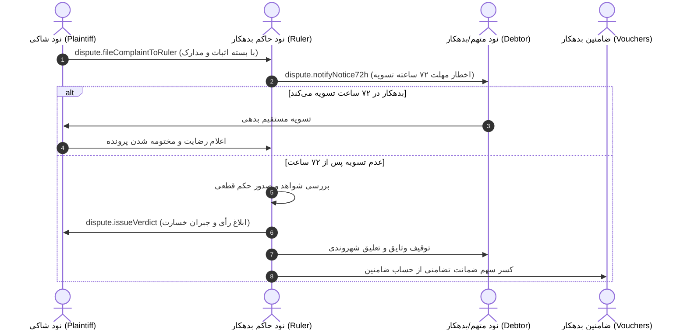

# بخش ۵: وب اعتماد محلی، ضمانت مشترک و ضمانت اجرای نکول (Trust Web & Dispute Resolution)

> **وضعیت سند:** استاندارد پیاده‌سازی مرجع (Normative Implementation Specification)  
> **انطباق با استانداردهای وب:** RFC 2119, RFC 8174, RFC 8785 (JCS), RFC 8032 (Ed25519)

---

## ۱. مدل اعتبارسنجی ارگانیک در برابر احراز هویت متمرکز

به جای تحمیل سامانه‌های متمرکز احراز هویت (KYC) که حریم خصوصی را تهدید می‌کنند یا حساب‌های بی‌نام بلاکچینی که امکان کلاهبرداری را تشدید می‌کنند، سامانه از **«وب اعتماد و ضمانت محلی»** استفاده می‌کند. در این الگو:
- هویت هر نود از تاییدهای امضاشده توسط همکاران، اصناف و معتمدین شبکه سرچشمه می‌گیرد.
- هر معرف با ثبت سند `LocalVouch`، سقف مشخصی از تعهدات شخص را ضمانت کرده و مسئولیت تضامنی مالی را می‌پذیرد.

---

## ۲. فرمول ریاضی رتبه اعتماد ارگانیک و مکانیزم مسئولیت تضامنی

### ۲.۱. فرمول محاسبه شاخص اعتبار ($R_u$) و زوال جریمه
شاخص اعتبار نود $u$ در بازه $[0.0, 1.0]$ به عنوان تابعی بازگشتی از وزن ضامنین و سوابق رفتاری محاسبه می‌شود:

$$R_u = \min \left( 1.0, \sum_{v \in \text{Vouchers}(u)} \left( W_v \times S_v \times \frac{\text{GuaranteedLimit}(v \to u)}{\text{BaselineLimit}} \right) \right) \times (1 - \text{DefaultFactor}(u))$$

#### محاسبه ریاضی ضریب نکول ($\text{DefaultFactor}$):
$$\text{DefaultFactor}(u) = 1.0 - \prod_{d \in \text{Defaults}(u)} e^{-\lambda \cdot \frac{\text{DefaultAmount}(d)}{\text{HistoricalVolume}(u)} \cdot 2^{-\frac{\Delta t_d}{\tau}}}$$

- $\lambda$: ضریب حساسیت ریسک سیستم (پیش‌فرض: $1.5$).
- $\tau$: نیمه‌عمر بخشش جریمه در صورت تسویه خسارت (پیش‌فرض: ۱۸۰ روز به ثانیه $= 15,552,000$).
- $\Delta t_d$: زمان سپری‌شده از تاریخ صدور حکم قطعی یا تسویه خسارت.

### ۲.۲. قالب‌های آماده و استاندارد ضمانت شفاف (`StandardGuaranteeRecord`)

برای جلوگیری از تفاسیر سلیقه‌ای و ابهام در تعهدات ضامنین، ضمانت میان نودها در قالب **۳ فرمت استاندارد و ماشین‌خوان** صادر و امضا می‌شود:

```typescript
export interface StandardGuaranteeRecord {
  guaranteeId: string;
  voucherPubKey: string;          // کلید نود ضامن
  subjectPubKey: string;          // کلید نود متعهد/بدهکار (ذی‌نفع ضمانت)
  guaranteeType: 
    | "FULL_JOINT_AND_SEVERAL"    // تضامنی کامل تا سقف معین (بدون قید و شرط)
    | "PRO_RATA_FRACTIONAL"       // درصدی/سهمی (مثلاً تقبل ۲۵٪ از خسارت نهایی)
    | "CONDITIONAL_UPON_VERDICT"; // مشروط به صدور حکم قطعی از حاکم یا داور تعیین‌شده
  terms: {
    maxGuaranteeAmount: number;   // سقف ریالی/اعتباری تعهد ضامن
    currencyUnit: string;         // واحد اعتباری
    coverageRatio?: number;       // درصد پوشش خسارت (برای نوع PRO_RATA)
    designatedArbitratorPubKey?: string; // کلید داور یا حاکم مرجع رسیدگی
  };
  validFrom: number;              // تاریخ آغاز شمول ضمانت
  validUntil: number;             // تاریخ انقضای مسئولیت ضامن
  voucherSignature: string;       // امضای Ed25519 ضامن
}
```

---

## ۳. پروتکل رسمی دادرسی و حل اختلاف از طریق حاکم شهروند (Dispute via Debtor's Ruler)

حاکم هر حکومت دیجیتال به عنوان **لنگرگاه دادرسی و رسیدگی به دعاوی شهروندان خود** عمل می‌کند. هرگونه امتناع نود حاکم از رسیدگی، منجر به کاهش ضریب نفوذ حاکمیت در گراف اعتماد سایر حاکمیت‌ها می‌گردد.



### ۳.۱. پیام‌های سیم پروتکل دادرسی (Wire Dispute RPCs):

#### ۱. ثبت دادخواست به حاکم بدهکار (`dispute.fileComplaintToRuler`):
```json
{
  "jsonrpc": "2.0",
  "id": "rpc-dispute-01",
  "method": "dispute.fileComplaintToRuler",
  "params": {
    "plaintiffPubKey": "aa112233...",
    "defendantCitizenPubKey": "bb223344...",
    "polityId": "polity_tehran_merchants",
    "proofBundle": {
      "claimId": "claim-9011ab",
      "documentId": "doc-inv-2026-081",
      "claimedDefaultAmount": 1200.00,
      "submittedAt": 1742415000000,
      "creditorAffidavitSignature": "sig_affidavit_hex..."
    }
  },
  "auth": {
    "senderPubKey": "aa112233...",
    "recipientPubKey": "ruler_pubkey_hex...",
    "timestamp": 1742415000000,
    "nonce": "dispute-nonce-01",
    "signature": "sig_ed25519_hex..."
  }
}
```

#### ۲. ابلاغیه اخطار ۷۲ ساعته حاکم به متهم (`dispute.notifyNotice72h`):
```json
{
  "jsonrpc": "2.0",
  "id": "rpc-dispute-02",
  "method": "dispute.notifyNotice72h",
  "params": {
    "disputeId": "dsp-1029384756",
    "plaintiffPubKey": "aa112233...",
    "claimedDefaultAmount": 1200.00,
    "deadlineTimestamp": 1742674200000,
    "rulerNoticeSignature": "sig_ruler_ed25519_hex..."
  }
}
```

#### ۳. صدور و ابلاغ حکم رسمی داوری (`dispute.issueVerdict`):
```json
{
  "jsonrpc": "2.0",
  "id": "rpc-dispute-03",
  "method": "dispute.issueVerdict",
  "params": {
    "awardRecord": {
      "awardId": "awd-9876543210abcdef0123456789abcdef",
      "disputedDocumentId": "doc-inv-2026-081",
      "arbitratorPubKey": "ruler_pubkey_hex...",
      "polityId": "polity_tehran_merchants",
      "verdict": "DEFAULT_CONFIRMED",
      "penalties": {
        "freezeDebtorDays": 30,
        "restitutionAmount": 1200.00,
        "guaranteeDrawnFromPool": 400.00,
        "guaranteeDrawnFromVouchers": 800.00
      },
      "timestamp": 1742675000000,
      "arbitratorSignature": "sig_ruler_award_hex..."
    }
  }
}
```

### ۳.۲. فرمول محاسبه شناسه حکم داوری (`awardId`):
$$\text{awardId} = \text{"awd-"} + \text{SHA-256-HEX}\big(\text{JCS}(\text{AwardDraftPreimage})\big)[0..32]$$

---

## ۴. نودهای گزارش و دیده‌بان‌های گزارش سیاه (Sentinel & Blacklist Report Nodes)

دیده‌بان‌های شبکه (Sentinel Nodes) گزارش‌های شفاف بدحسابی را تجمیع نموده و بدون امکان سانسور در اختیار استعلام‌کنندگان قرار می‌دهند.

```typescript
export interface BlackReportRecord {
  reportId: string;
  reporterPubKey: string;          // کلید عمومی شاکی / گزارش‌دهنده
  accusedPubKey: string;           // کلید عمومی نود متخلف
  incidentCategory: 
    | "DEFAULT_ON_OBLIGATION"      // عدم تسویه بدهی و نقض تعهد مالی
    | "FRAUDULENT_BEHAVIOR"        // رفتار فریبکارانه، جعل یا غش در معامله
    | "DEFECTIVE_SERVICE"          // عدم تحویل کالا یا نقص فاحش در خدمت
    | "BREACH_OF_TIME_SLOT";       // نقض مکرر بازه‌های زمانی رزرو
  incidentDetails: {
    description: string;
    violatedClaimId?: string;      // شناسه سند تعهدی که نقض شده است
    lossAmount?: number;
    evidenceHash?: string;         // هش SHA-256 از شواهد دیجیتال
  };
  timestamp: number;
  reporterSignature: string;       // امضای Ed25519 غیرقابل‌انکار گزارش‌دهنده
  counterStatement?: {
    statement: string;
    arbitrationVerdictId?: string; // حکم برائت از حاکمیت یا داور
    timestamp: number;
    accusedSignature: string;
  };
}
```

### ۴.۱. فرمول محاسبه شناسه گزارش سیاه (`reportId`):
$$\text{reportId} = \text{"rpt-"} + \text{SHA-256-HEX}\big(\text{JCS}(\text{ReportDraftPreimage})\big)[0..32]$$

### ۴.۲. جدول کدهای خطای پروتکل حل اختلاف:
| کد خطا | عنوان | شرح مهندسی |
| :--- | :--- | :--- |
| `-32006` | `ERR_CLAIM_DEFAULTED` | سند در وضعیت نکول قطعی قرار گرفته است. |
| `-32008` | `ERR_DISPUTE_IN_PROGRESS` | سند در جریان رسیدگی حاکم یا کارگزار داور است. |
| `-32011` | `ERR_ARBITRATION_FAILED` | حکم داوری نامعتبر، خارج از صلاحیت یا فاقد امضای معتبر حاکم است. |
| `-32012` | `ERR_DEFAMATION_REJECTED` | گزارش سیاه فاقد اثبات تعامل تجاری قبلی یا با انگیزه مخرب ارسال شده است. |

