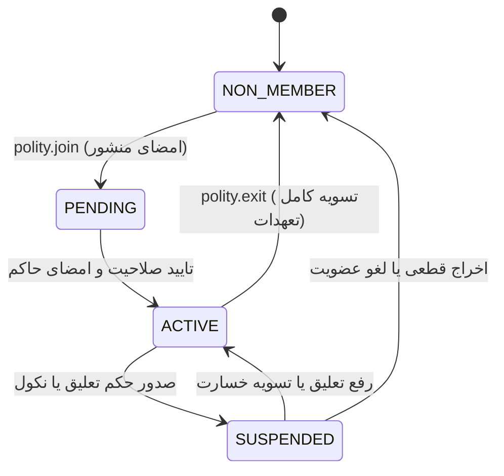
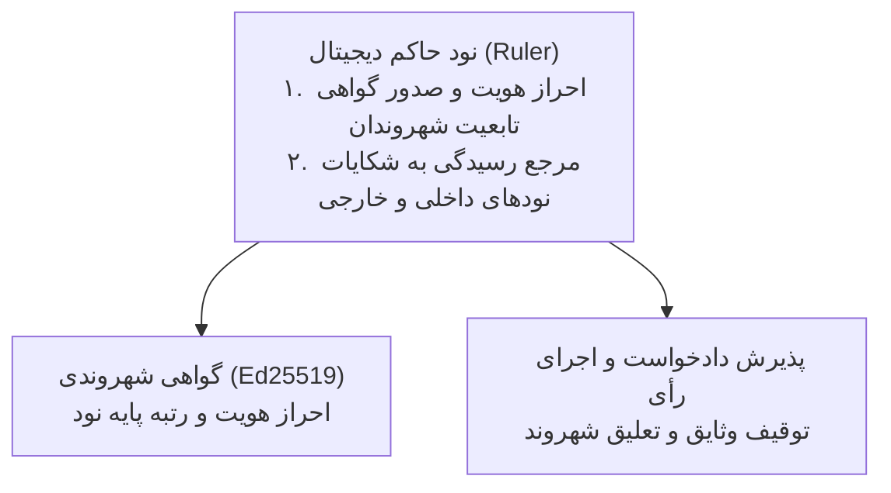

# بخش ۶: ساختار حکومت‌های دیجیتال، کارگزاران و پیمان‌های حاکمیتی (Digital Polities & Governance)

> **وضعیت سند:** استاندارد پیاده‌سازی مرجع (Normative Implementation Specification)  
> **انطباق با استانداردهای وب:** RFC 2119, RFC 8174, RFC 8785 (JCS), RFC 8032 (Ed25519)

---

## ۱. اصل بنیادین: حاکمیت رضایتمندانه (Pure Consent & Instant Exit)

در جغرافیای سرزمینی، تداخل فیزیکی زمینه را برای حاکمیت اکثریت قهری (تحمیل اراده ۵۱٪ بر ۴۹٪) فراهم می‌سازد. در جغرافیای دیجیتال به دلیل فقدان اصطکاک مکانی، حاکمیت بر دو اصل قطعی بازمهندسی شده است:
1. **پیوستن و جدایی بر پایه رضایت ۱۰۰٪:** پیوستن به هر تشکل یا حکومت دیجیتال با امضای دیجیتال منشور آن تشکل صورت می‌گیرد و خروج از آن نیز با صدور یک‌طرفه «سند اعلام خروج» در هر لحظه امکان‌پذیر است (**اصل رأی‌دادن با پا / Voting with Feet**). خروج تنها مشروط به تسویه تعهدات باز پیشین در دفاتر شهود است.
2. **چندشهروندی همزمان:** هر شخص می‌تواند بدون تعارض منافع، همزمان عضو چندین حکومت تخصصی یا صنفی باشد.

### ۱.۱. چرخه حیات عضویت و تابعیت (Membership State Machine):


---

## ۲. ساختار تک‌لایه‌ای مسطح و وظایف دوگانه بنیادین حاکم (Flat Governance & Ruler's Core Roles)

جهت رعایت اصل میانه‌روی و حذف بوروکراسی اداری زاید (روستا، شهر، ایالت و کشور)، ساختار حاکمیت در قالب یک موجودیت استاندارد مهندسی شده است: **«حکومت دیجیتال (Digital Polity)»**

در این الگو، **حاکم (Ruler)** دو وظیفه لاینفک و بنیادین بر عهده دارد:
1. **احراز هویت و صدور گواهی تابعیت نودهای شهروند (`CitizenshipCertificate`)**
2. **لنگرگاه قضایی و مرجع رسیدگی به شکایات دیگر نودها (همشهری یا خارجی) علیه شهروند خود**



### ۲.۱. ساختار سند گواهی هویت و شهروندی (`CitizenshipCertificate`):
```typescript
export interface CitizenshipCertificate {
  certificateId: string;
  polityId: string;
  rulerPubKey: string;              // کلید حاکم صادرکننده
  citizenPubKey: string;            // کلید نود شهروند
  identityProfile: {
    publicAlias: string;            // نام تجاری یا شناسه عمومی شهروند
    verificationTier: "BASIC" | "VERIFIED_MERCHANT" | "INSTITUTIONAL";
    jurisdictionConsent: true;      // پذیرش صریح صلاحیت حاکم در داوری اختلافات
  };
  issuedAt: number;
  expiresAt?: number;
  rulerSignature: string;           // امضای قطعی حاکم
}
```

#### محاسبه ریاضی شناسه گواهی شهروندی:
$$\text{certificateId} = \text{"cert-"} + \text{SHA-256-HEX}\big(\text{JCS}(\text{CertificateDraftPreimage})\big)[0..32]$$

---

## ۳. پیام‌های سیمی پروتکل حکمرانی و تابعیت (Wire Polity RPCs)

### ۳.۱. درخواست عضویت در حکومت (`polity.join`):
```json
{
  "jsonrpc": "2.0",
  "id": "plt-join-01",
  "method": "polity.join",
  "params": {
    "polityId": "polity_tehran_merchants",
    "charterHash": "sha256_charter_hex...",
    "citizenProfile": {
      "publicAlias": "Tehran Leathercraft",
      "verificationTier": "VERIFIED_MERCHANT",
      "jurisdictionConsent": true
    }
  },
  "auth": {
    "senderPubKey": "aa112233...",
    "recipientPubKey": "ruler_pubkey_hex...",
    "timestamp": 1742415000000,
    "nonce": "plt-nonce-01",
    "signature": "sig_citizen_ed25519_hex..."
  }
}
```

### ۳.۲. اعلام خروج فوری نود از حکومت (`polity.exit`):
```json
{
  "jsonrpc": "2.0",
  "id": "plt-exit-01",
  "method": "polity.exit",
  "params": {
    "polityId": "polity_tehran_merchants",
    "exitAffidavit": "I have settled all pending obligations within this polity.",
    "effectiveTimestamp": 1742416000000
  },
  "auth": {
    "senderPubKey": "aa112233...",
    "recipientPubKey": "ruler_pubkey_hex...",
    "timestamp": 1742416000000,
    "nonce": "plt-nonce-02",
    "signature": "sig_citizen_ed25519_hex..."
  }
}
```

---

## ۴. کارگزاران، گواهی مأموریت و لغو تفویض اختیار (Agent Mandates & Revocation)

حاکم وظایف اجرایی و تخصصی را از طریق اسناد مأموریت رمزنگاری‌شده (`AgentMandateRecord`) به کارگزاران واگذار می‌کند:
1. **کارگزار گواهی و ثبت رسمی (Attestation Agent)**
2. **کارگزار داوری و رسیدگی به اختلافات (Arbitration Agent)**
3. **کارگزار خزانه‌داری و صندوق ضمانت (Treasury Agent)**

### ۴.۱. سند گواهی مأموریت کارگزار (`AgentMandateRecord`):
```typescript
export interface AgentMandateRecord {
  mandateId: string;
  polityId: string;
  rulerPubKey: string;
  agentPubKey: string;
  role: "ATTESTATION_AGENT" | "ARBITRATION_AGENT" | "TREASURY_AGENT";
  scope: {
    canSignAttestations: boolean;
    canIssueArbitrationAwards: boolean;
    maxAuthorizedGuaranteeExposure: number;
  };
  validFrom: number;
  validUntil: number;
  rulerSignature: string;
}
```
$$\text{mandateId} = \text{"mnd-"} + \text{SHA-256-HEX}\big(\text{JCS}(\text{MandateDraftPreimage})\big)[0..32]$$

### ۴.۲. سند ابطال آنی مأموریت کارگزار (`AgentRevocationCertificate`):
```typescript
export interface AgentRevocationCertificate {
  revocationId: string;
  polityId: string;
  rulerPubKey: string;
  targetAgentPubKey: string;
  effectiveTimestamp: number;
  reason: string;
  rulerSignature: string;
}
```

---

## ۵. ماتریس ۴ سطحی معاهدات میان‌حاکمیتی (Inter-Ruler Treaty Matrix)

ارتباط و اعتبار متقابل میان شهروندان دو حکومت ناآشنا از طریق معاهدات دوجانبه رسمی میان حاکمان آنها برقرار می‌شود:

| سطح معاهده | نام سطح | مشخصات فنی و تبادلی | دستاورد عملیاتی برای اعضا |
| :--- | :--- | :--- | :--- |
| **سطح ۱** | **شناسایی پایه (Basic Peering)** | تبادل کلیدهای عمومی و فعال‌سازی خط ارتباطی mTLS | امکان ارسال پیام امن و استعلام وضعیت عضویت افراد |
| **سطح ۲** | **شهادت مشترک (Mutual Witnessing)** | کارگزاران شهادت حکومت A مجاز به حضور در کووروم اعضای حکومت B هستند | افزایش عمق استخر معتمدین مشترک ($M_{AB}$) جهت تشکیل کووروم ۵ شاهد |
| **سطح ۳** | **خط اعتبار متقابل (Bilateral Credit Line)** | تخصیص خط ضمانت متقابل میان صندوق‌های خزانه‌داری دو حکومت | انجام مبادلات تجاری نسیه بدون نیاز به واریز وثیقه نقدی |
| **سطح ۴** | **حوزه قضایی مشترک (Joint Arbitration)** | به رسمیت شناختن احکام کارگزاران داوری یکدیگر در حل اختلافات | اجرای احکام ضبط وثیقه و مسدودسازی نودهای متخلف در هر دو قلمرو |

### سند رسمی معاهده میان دو حاکم (`InterRulerTreatyRecord`):
```typescript
export interface InterRulerTreatyRecord {
  treatyId: string;
  polityA: {
    polityId: string;
    rulerPubKey: string;
    signature: string;
  };
  polityB: {
    polityId: string;
    rulerPubKey: string;
    signature: string;
  };
  trustLevel: 1 | 2 | 3 | 4;
  terms: {
    mutualWitnessQuorumAllowed: boolean;
    bilateralGuaranteeExposureLimit: number;
    sharedArbitratorPubKey?: string;
  };
  establishedAt: number;
}
```
$$\text{treatyId} = \text{"try-"} + \text{SHA-256-HEX}\big(\text{JCS}(\text{TreatyDraftPreimage})\big)[0..32]$$

### ۵.۱. کدهای خطای پروتکل حکمرانی و معاهدات:
| کد خطا | عنوان | شرح مهندسی |
| :--- | :--- | :--- |
| `-32013` | `ERR_CITIZENSHIP_INVALID` | گواهی شهروندی نامعتبر، منقضی یا باطل شده است. |
| `-32014` | `ERR_TREATY_NOT_FOUND` | معاهده‌ای در سطح مورد درخواست میان حاکمان مبدأ و مقصد وجود ندارد. |
| `-32015` | `ERR_MANDATE_REVOKED` | مأموریت کارگزار توسط حاکم لغو گردیده و امضای وی فاقد اثر است. |
| `-32016` | `ERR_EXIT_OBLIGATIONS_PENDING` | خروج از حکومت به دلیل وجود تعهدات مالی باز یا پرونده داوری معلق رد شد. |
