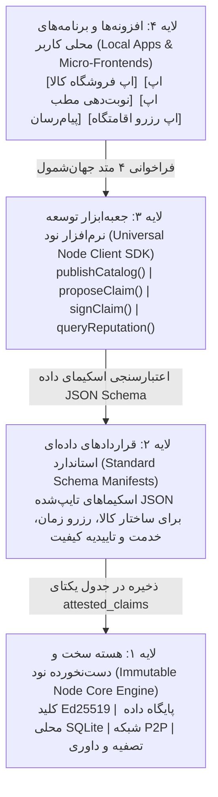
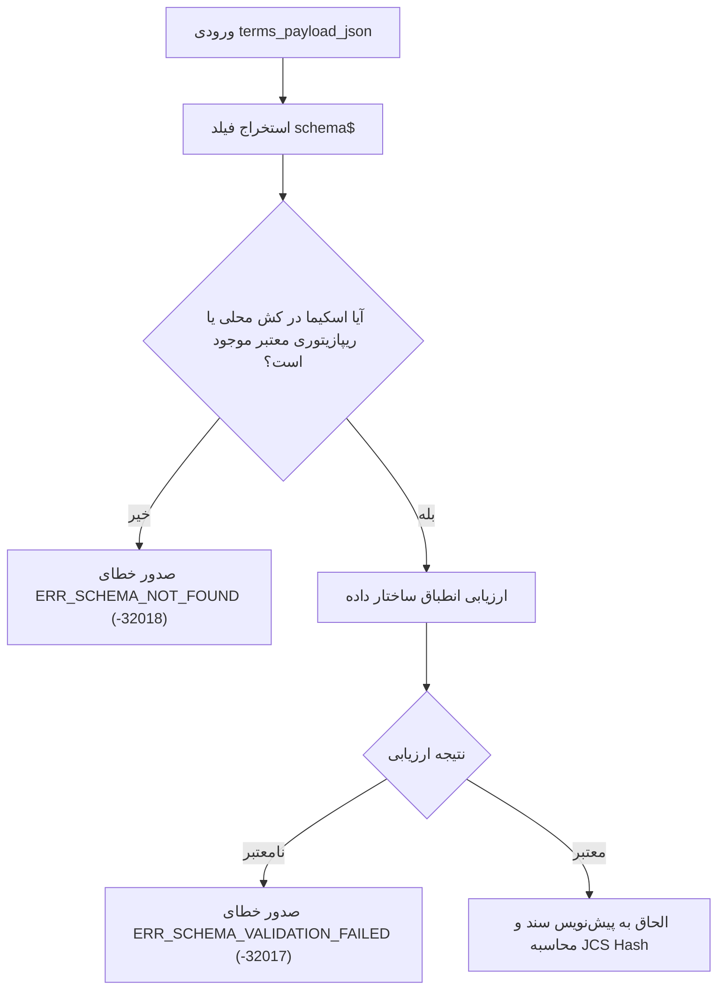

# بخش ۷: بستر باز توسعه خدمات، معماری میکرو‌-اپ و جعبه‌ابزار توسعه
## Extensible App Platform, Micro-App Architecture & Universal Node SDK

> **وضعیت سند:** استاندارد پیاده‌سازی مرجع (Normative Implementation Specification)  
> **انطباق با استانداردهای وب:** RFC 2119, RFC 8174, RFC 8785 (JCS), JSON Schema Draft 2020-12

---

## ۱. اصل بنیادین: هسته نابینا به کسب‌وکار (Core Agnosticism)

بزرگ‌ترین خطای معماری در سیستم‌های متمرکز یا بلاکچینی این است که برای هر مفهوم تجاری جدید (مثل «سایز کفش»، «تخصص پزشک»، یا «شماره میز رستوران»)، پایگاه‌داده اصلی یا پروتکل اجماع دستکاری می‌شود.

در این معماری:
- **هسته نود (Core Node Engine) نسبت به نوع کسب‌وکار کاملاً بی‌خبر است.**
- هسته فقط یک مفهوم حقوقی/مالی جهان‌شمول به نام **«سند ادعا و تعهد گواهی‌شده (`AttestedClaim`)»** را می‌فهمد که دارای متعهد، ذی‌نفع، مهلت سررسید و امضای دیجیتال است.
- تمامی جزئیات خاص هر کسب‌وکار در قالب یک شیء ساختاریافته در فیلد `terms_payload_json` کپسوله می‌شود.

---

## ۲. پشته ۴ لایه‌ای توسعه خدمات



---

## ۳. نگاشت متدهای SDK به JSON-RPC محلی دیمون (Local Daemon IPC API)

کتابخانه `@universal-node/sdk` از طریق اتصال سوکت IPC یا لوکال‌هاست امن (`http://127.0.0.1:3000/rpc/v1`) با دیمون محلی گفتگو می‌کند.

### ۳.۱. جدول نگاشت متدها و امضاهای تایپ‌اسکریپت:
```typescript
export interface UniversalNodeClient {
  /**
   * ۱. انتشار فهرست کالاها، خدمات یا بازه‌های زمانی خالی نود
   * نگاشت به RPC دیمون: node.publishCatalog
   */
  publishCatalog(items: CatalogItem[]): Promise<{ publishedCount: number; catalogHash: string }>;

  /**
   * ۲. صدور پیشنهاد تعهد یا ثبت سفارش / رزرو
   * نگاشت به RPC دیمون: claim.propose
   */
  proposeClaim(draft: ClaimDraft): Promise<AttestedClaim>;

  /**
   * ۳. تایید و امضای دوجانبه تعهد با کلید محلی نود
   * نگاشت به RPC دیمون: claim.sign
   */
  signClaim(documentId: string): Promise<AttestedClaim>;

  /**
   * ۴. استعلام یکپارچه سوابق (تاییدیه‌های مثبت کیفیت و گزارش‌های سیاه)
   * نگاشت به RPC دیمون: reputation.query
   */
  queryReputation(targetPubKey: string): Promise<ReputationProfile>;
}
```

### ۳.۲. نمونه تراکنش محلی صدور تعهد (`claim.propose`):
```json
{
  "jsonrpc": "2.0",
  "id": "sdk-call-01",
  "method": "claim.propose",
  "params": {
    "creditorPubKey": "bb223344...",
    "claimType": "TIME_SLOT_RESERVATION",
    "amount": 25.0,
    "unit": "ORGANIC_CREDIT",
    "dueTimestamp": 1742675000000,
    "termsPayloadJson": "{\"slotId\":\"SLOT-991\",\"$schema\":\"https://schemas.cell.network/v1/booking.json\"}"
  }
}
```

---

## ۴. خط لوله اعتبارسنجی اسکیما (Schema Validation Pipeline)

پیش از ارسال هر ادعا، دیمون محلی در `ApplicationPort` صحت فیلد `terms_payload_json` را بر اساس استاندارد JSON Schema Draft 2020-12 اعتبارسنجی می‌نماید:



### ۴.۱. الگوهای استاندارد داده در `terms_payload_json`

#### ۱. فروشگاه و سفارش کالا (`STORE_ORDER`):
```json
{
  "$schema": "https://schemas.cell.network/v1/store-order.json",
  "orderId": "ORD-2026-9081",
  "items": [
    { "sku": "SHOES-LEATHER-42", "title": "کفش چرم دست‌دوز", "quantity": 1, "unitPrice": 45.0 }
  ],
  "delivery": {
    "recipientName": "سهراب سپهری",
    "deliveryMethod": "POSTAL_EXPRESS",
    "encryptedAddress": "x25519_cipher_payload..."
  }
}
```

#### ۲. نوبت‌دهی پزشک، رستوران و مشاوره (`TIME_SLOT_RESERVATION`):
```json
{
  "$schema": "https://schemas.cell.network/v1/time-slot.json",
  "slotId": "DR-HEART-20261014-1630",
  "serviceTitle": "مشاوره تخصصی قلب و عروق",
  "startTimestamp": 1791813600,
  "durationMinutes": 30,
  "attendanceTerms": {
    "cancellationDeadlineHours": 24,
    "penaltyRatio": 0.5
  }
}
```

#### ۳. قرارداد پروژه و کار فریلنسری (`SERVICE_CONTRACT`):
```json
{
  "$schema": "https://schemas.cell.network/v1/service-contract.json",
  "projectCode": "PRJ-DESIGN-01",
  "milestones": [
    { "title": "تحویل پروتوتایپ رابط کاربری", "amount": 100.0, "deadlineTimestamp": 1792400000 },
    { "title": "کدنویسی نهایی کلاینت", "amount": 150.0, "deadlineTimestamp": 1793000000 }
  ],
  "arbitrationAgreement": {
    "courtPolityPubKey": "POLITY_PUBKEY_GUILD_OF_SOFTWARE"
  }
}
```

---

## ۵. مانیفست کشف خودکار قابلیت‌ها (`node-capabilities.json`)

هر نود در آدرس روت خود فایل مشخصات ماشین‌خوان زیر را میزبانی می‌کند:

```json
{
  "nodePubKey": "ed25519_pubkey_abc123...",
  "nodeName": "کلینیک سلامت دانا",
  "apiVersion": "1.0.0",
  "supportedServices": [
    {
      "serviceType": "TIME_SLOT_RESERVATION",
      "name": "سیستم رزرو آنلاین نوبت ویزیت",
      "manifestUrl": "/apps/booking/manifest.json",
      "endpoints": {
        "querySlots": "/api/v1/booking/slots",
        "reserveSlot": "/api/v1/booking/reserve"
      }
    }
  ]
}
```

---

## ۶. الگوی توسعه سرویس بدون تغییر دیمون (Zero-Daemon-Change Playbook)

هر توسعه‌دهنده بدون نیاز به ارتقای نرم‌افزار نود (Hard Fork) یا تغییر جداول SQLite، عمودهای جدید را با ۳ گام می‌سازد:
1. **تعریف اسکیمای JSON** با نگارش Draft 2020-12.
2. **اعلام ماژول در `node-capabilities.json`**.
3. **فراخوانی `proposeClaim`** در کلاینت با ارسال payload مناسب.

#### ۶.۱. جدول کدهای خطای بستر افزونه و SDK:
| کد خطا | عنوان | شرح مهندسی |
| :--- | :--- | :--- |
| `-32017` | `ERR_SCHEMA_VALIDATION_FAILED` | ساختار `terms_payload_json` با اسکیمای اعلام‌شده مطابقت ندارد. |
| `-32018` | `ERR_SCHEMA_NOT_FOUND` | اسکیمای ارجاع‌شده در شناسه URI یافت نشد یا غیرقابل دسترس است. |
| `-32019` | `ERR_CAPABILITY_UNSUPPORTED` | نود مقصد از خدمت، نسخه پروتکل یا ماژول درخواستی پشتیبانی نمی‌کند. |
| `-32020` | `ERR_PAYLOAD_TOO_LARGE` | اندازه `terms_payload_json` از سقف مجاز (۶۴ کیلوبایت) تجاوز کرده است. |

---

## ۷. نمونه کد اجرایی: پیاده‌سازی رزرو نوبت در چند خط کد

نمونه کدی که یک برنامه‌نویس وب برای رزرو نوبت پزشک با استفاده از این بستر می‌نویسد:

```typescript
import { UniversalNodeClient } from '@universal-node/sdk';

async function bookDoctorAppointment(doctorNodeUrl: string, selectedSlotId: string) {
  const client = new UniversalNodeClient();

  // ۱. بررسی اعتبار و گزارش‌های سیاه پزشک پیش از رزرو
  const rep = await client.queryReputation(doctorNodeUrl);
  if (rep.activeBlackReportsCount > 0) {
    throw new Error("هشدار: این نود دارای گزارش سیاه حل‌نشده در شبکه است.");
  }

  // ۲. صدور سند تعهد دوجانبه برای رزرو وقت
  const reservationClaim = await client.proposeClaim({
    targetPubKey: doctorNodeUrl,
    claimType: "TIME_SLOT_RESERVATION",
    amount: 25.0,
    unit: "ORGANIC_CREDIT",
    dueTimestamp: Date.now() + (7 * 86400 * 1000), // ۷ روز آینده
    description: "رزرو ویزیت مشاوره قلب و عروق",
    terms: {
      slotId: selectedSlotId,
      patientNote: "نیاز به بررسی جواب نوار قلب"
    }
  });

  // ۳. امضای نهایی و قطعی‌سازی وقت در تقویم هر دو نود
  await client.signClaim(reservationClaim.documentId);
  console.log("نوبت با موفقیت قطعی و ثبت شد:", reservationClaim.documentId);
}
```

---

## ۷. دستاوردهای کلیدی این معماری

| چالش توسعه سنتی | راهکار معماری میکرو‌-اپ در این سامانه |
| :--- | :--- |
| **تغییر مداوم دیتابیس برای خدمات جدید** | جدول یکتا و ثابت `attested_claims` با متادیتای منعطف `terms_payload_json`. |
| **گره‌خوردن منطق بیزینس با کدهای امنیت** | تفکیک کامل: هسته کور نسبت به بیزینس، SDK انتزاعی برای برنامه‌نویسان. |
| **نیاز به اپ استورهای انحصاری برای انتشار برنامه** | میزبانی مستقل افزونه روی نود با پروتکل استاندارد کشف قابلیت‌ها (`capabilities.json`). |
| **نبود اعتماد در خدمات آنلاین ناآشنا** | پیوند خودکار تمام خدمات به وب اعتماد، رزومه اعتباری و دیده‌بان‌های گزارش سیاه. |

---

## ۸. الگوی توسعه سرویس‌های جدید بدون نیاز به بازمعماری دیمون (Zero-Daemon-Change Playbook)

هر توسعه‌دهنده در هر گوشه جهان می‌تواند یک عمود کسب‌وکاری کاملاً جدید را با طی ۳ گام ساده بدون دستکاری حتی ۱ خط از کدهای دیمون نود یا تغییر اسکیمای SQLite پیاده‌سازی کند:

### گام اول: تعریف اسکیمای قرارداد اختصاصی (JSON Schema Specification)
توسعه‌دهنده ساختار مورد نظر خود را در قالب یک فایل JSON Schema استاندارد تدوین کرده و یک URI یکتا به آن اختصاص می‌دهد (مثلاً `https://schemas.cell.network/v1/ai-compute-rental.json`):

```json
{
  "$schema": "https://json-schema.org/draft/2020-12/schema",
  "title": "AiComputeRentalTerms",
  "type": "object",
  "properties": {
    "gpuModel": { "type": "string", "enum": ["NVIDIA_A100", "NVIDIA_H100", "RTX_4090"] },
    "durationHours": { "type": "integer", "minimum": 1 },
    "vramGigabytes": { "type": "integer", "minimum": 16 },
    "sshEndpoint": { "type": "string" },
    "authorizedSshKey": { "type": "string" }
  },
  "required": ["gpuModel", "durationHours", "vramGigabytes"]
}
```

### گام دوم: اعلام پشتیبانی در `capabilities.json` نود
نود عرضه‌کننده سرویس، پشتیبانی از این افزونه را در فایل قابلیت‌های استاتیک خود اعلام می‌کند:
```json
{
  "extensionId": "ext-ai-compute-market",
  "version": "1.0.0",
  "supportedClaimTypes": ["SERVICE_CONTRACT"],
  "schemaUri": "https://schemas.cell.network/v1/ai-compute-rental.json",
  "uiBundleUrl": "/apps/ai-compute/index.html"
}
```

### گام سوم: صدور سند تعهد از طریق SDK کلاینت
کاربر متقاضی از طریق SDK تعهد را پیشنهاد داده و نود ارائه‌دهنده سرویس به طور خودکار پس از دریافت سند معتبر و اعتبارسنجی ظرفیت اعتباری، دسترسی به سرور را فعال می‌کند:
```typescript
const computeRental = await client.proposeClaim({
  targetPubKey: gpuProviderPubKey,
  claimType: "SERVICE_CONTRACT",
  amount: 120.0,
  unit: "ORGANIC_CREDIT",
  dueTimestamp: Date.now() + (24 * 3600 * 1000),
  description: "اجاره ۲۴ ساعته کلاستر پردازش H100",
  terms: {
    $schema: "https://schemas.cell.network/v1/ai-compute-rental.json",
    gpuModel: "NVIDIA_H100",
    durationHours: 24,
    vramGigabytes: 80,
    authorizedSshKey: "ssh-ed25519 AAAAC3NzaC1lZDI1NTE5..."
  }
});
```

**نتیجه معماری:** هیچ نیازی به ارتقای نرم‌افزار نود (Hard Fork)، بازنویسی لایه ذخیره‌سازی، یا هماهنگی با سایر نودهای شبکه وجود ندارد. شبکه به طور طبیعی و بی‌پایان گسترش‌پذیر است.
