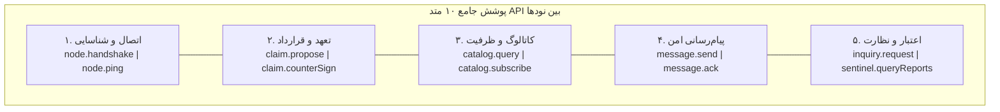
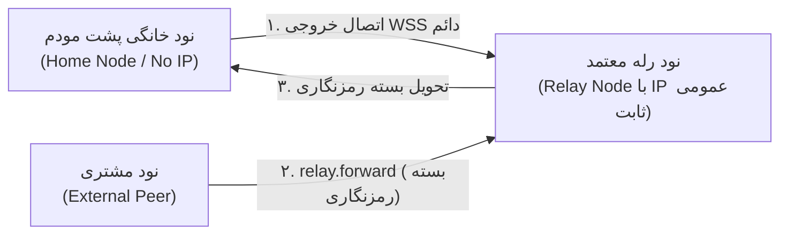

# بخش ۸: پروتکل سیمی، رابط‌های API و سیستم نوتیفیکیشن بلادرنگ بین نودها
## Inter-Node Wire Protocol, Universal JSON-RPC APIs & Real-Time Push Events

> **وضعیت سند:** استاندارد پیاده‌سازی مرجع (Normative Implementation Specification)  
> **انطباق با استانداردهای وب:** RFC 2119, RFC 8174, RFC 8785 (JCS), RFC 8032 (Ed25519), JSON-RPC 2.0

این سند استاندارد رسمی ارتباطات شبکه، پروتکل سیمی (Wire Protocol)، لیست کامل متدهای API و مکانیزم ارسال و دریافت نوتیفیکیشن‌های بلادرنگ میان نودهای شخصی را مشخص می‌کند. این استاندارد به گونه‌ای طراحی شده است که **تمام نودهای شبکه از یک پایگاه‌کد واحد (Single Codebase)** ساخته شوند و هر نود بر حسب نیاز خود، ماژول‌های مورد نظر را با پرچم‌های ساده فعال یا غیرفعال سازد.

---

## ۱. لایه انتقال و قالب پروتکل سیمی (Transport Layer & Framing)

ارتباط میان نودها بر بستر دو پروتکل استاندارد صورت می‌پذیرد:
- **WebSocket ایمن (WSS / TLS 1.3):** برای کانال‌های دائمی، استعلام‌های کم‌تاخیر و دریافت بلادرنگ نوتیفیکیشن‌های Push.
- **HTTPS / mTLS (اختیاری برای نودهای رسمی):** جهت درخواست‌های یک‌باره و استعلام‌های بدون نیاز به اتصال طولانی.

### ۱.۱. ساختار پاکت درخواست بر پایه استاندارد JSON-RPC 2.0
تمامی درخواست‌ها دارای پاکت احراز هویت رمزنگاری‌شده (Signature Envelope) هستند تا هیچ پیامی بدون مسئولیت‌پذیری فرستنده مبادله نشود:

```typescript
export interface InterNodeRequestEnvelope<T = any> {
  jsonrpc: "2.0";
  id: string;                      // شناسه یکتای پیام (UUID v4)
  method: string;                  // نام متد API (مانند "claim.propose")
  params: T;                       // داده‌های پارامتر متد
  auth: {
    senderPubKey: string;          // کلید عمومی نود فرستنده (Ed25519 hex/base64)
    recipientPubKey: string;       // کلید عمومی نود مقصد
    timestamp: number;             // برچسب زمانی هماهنگ جهانی (Unix ms)
    nonce: string;                 // رشته تصادفی ضد بازپخش (حداقل ۱۶ کاراکتر)
    signature: string;             // امضای Ed25519 بر پیش‌تصویر امضا
  };
}
```

#### محاسبه ریاضی امضای پاکت سیمی (Wire Authentication Signature):
$$\text{SignaturePreimage} = \text{JCS}\big(\{\text{"id"}: \text{id}, \text{"method"}: \text{method}, \text{"nonce"}: \text{nonce}, \text{"params"}: \text{params}, \text{"recipientPubKey"}: \text{recipientPubKey}, \text{"timestamp"}: \text{timestamp}\}\big)$$
$$\text{auth.signature} = \text{Ed25519Sign}\Big(\text{PrivKey}_{\text{sender}}, \text{SHA-256-HEX}\big(\text{SignaturePreimage}\big)\Big)$$

---

## ۲. ساختار پاکت رویداد و نوتیفیکیشن بلادرنگ (Push Event Frame)

هنگامی که رخدادی در نود الف ایجاد می‌شود و باید فوراً به نود ب اطلاع داده شود:

```typescript
export interface InterNodePushEventFrame<T = any> {
  jsonrpc: "2.0";
  event: string;                   // نام رویداد (مانند "claim.proposed")
  payload: T;
  timestamp: number;
  emitterPubKey: string;           // نود صادرکننده اعلان
  signature: string;               // امضای دیجیتال اعلان
}
```

---

## ۳. معماری کد واحد با ماژول‌های فعال‌پذیر (Single Codebase, Modular Activation)

تمامی نودها دارای یک فایل پیکربندی محلی ساده به نام `node-config.json` هستند که قابلیت‌های فعال در آن تعیین می‌شود:

```json
{
  "nodePubKey": "ed25519_key_908a7b...",
  "listenPort": 8443,
  "activeModules": {
    "module_core": true,           // هسته شبکه، امضا و مدیریت تعهدات (همیشه الزامی)
    "module_store": true,          // بازارچه و کاتالوگ فروش محصولات (اختیاری)
    "module_booking": true,        // سیستم نوبت‌دهی و رزرو زمان (اختیاری)
    "module_messaging": true,      // پیام‌رسان دوطرفه امن (اختیاری)
    "module_sentinel": false,      // نود دیده‌بان و گزارش سیاه (اختیاری)
    "module_arbitration": false    // کارگزار داوری منشور حاکمیت (اختیاری)
  }
}
```

اگر نودی ماژولی را غیرفعال کند (`false`)، درخواست‌های مربوط به آن ماژول با کد خطای استاندارد `METHOD_NOT_SUPPORTED (-32601)` پاسخ داده می‌شوند.

---

## ۴. فهرست کامل ۱۰ متد فراگیر API

کل نیازمندی‌های این معماری (از بانکداری و تسویه تا پیام‌رسان و رزرو) با ۱۰ متد زیر پوشش داده می‌شود:



### ۴.۱. گروه اول: هسته و دست‌تکانی نودها (Core Handshake)
* **`node.handshake`**
  - **ورودی:** اعلام کلید عمومی و زمان نود فرستنده.
  - **خروجی:** ماتریس ماژول‌های فعال نود مقصد و نسخه پروتکل:
    ```json
    {
      "nodePubKey": "ed25519_target_key...",
      "activeCapabilities": ["STORE", "BOOKING", "MESSAGING"],
      "protocolVersion": "1.0.0"
    }
    ```
* **`node.ping`**
  - **کاربرد:** بررسی وضعیت فعال بودن سرور ۲۴/۷ و اندازه‌گیری تاخیر زمانی (Latency).

---

### ۴.۲. گروه دوم: تعهدات و قراردادهای دوجانبه (Universal Claims Engine)
* **`claim.propose` (پیشنهاد تعهد / ثبت سفارش / رزرو وقت / قرارداد)**
  - **پارامترها:**
    ```typescript
    {
      claimType: "FINANCIAL_OBLIGATION" | "TIME_SLOT_RESERVATION" | "SERVICE_CONTRACT";
      amount: number;
      unit: string;
      dueTimestamp: number;
      description: string;
      termsPayload: Record<string, any>; // متادیتای اختصاصی کالا، رزرو یا قرارداد
      initiatorSignature: string;
    }
    ```
  - **رویداد Push ارسالی:** نود گیرنده بلافاصله رویداد `claim.proposed` را روی صفحه کاربر نمایش می‌دهد.
* **`claim.counterSign` (امضای دوجانبه و نهایی‌سازی)**
  - **پارامترها:** `{ documentId: string, counterSignature: string }`
  - **رویداد Push ارسالی:** به نود فرستنده رویداد `claim.committed` ارسال شده و سند در پایگاه‌داده محلی هر دو طرف قطعی و بایگانی می‌شود.

---

### ۴.۳. گروه سوم: کاتالوگ و ظرفیت‌های عرضه (Catalog & Capacity Discovery)
* **`catalog.query`**
  - **پارامترها:** `{ category: "PRODUCTS" | "TIME_SLOTS" | "SERVICES", filter?: Record<string, any> }`
  - **خروجی:** بازه‌های زمانی خالی مطب پزشک، اتاق‌های هتل یا فهرست اجناس فروشگاه با قیمت و موجودی لحظه‌ای.
* **`catalog.subscribe`**
  - **پارامترها:** `{ targetPubKey: string, eventType: "SLOT_FREED" | "PRICE_DROP" }`
  - **کاربرد:** ثبت اشتراک نوتیفیکیشن برای دریافت خبر باز شدن نوبت خالی لغوشده یا تغییر موجودی کالا.

---

### ۴.۴. گروه چهارم: پیام‌رسانی امن همتا (Encrypted P2P Messaging)
* **`message.send`**
  - **پارامترها:**
    ```typescript
    {
      conversationId: string;
      ciphertext: string;            // متن رمزنگاری‌شده با الگوریتم X25519
      ephemeralSenderPubKey: string; // کلید موقت نشست
      requiresAttestation: boolean;  // آیا پیام سندیت حقوقی دارد؟
    }
    ```
  - **رویداد Push ارسالی:** رویداد `message.received` روی کلاینت گیرنده پاپ‌آپ می‌شود.
* **`message.ack`**
  - **پارامترها:** `{ messageId: string, status: "DELIVERED" | "READ" }`

---

### ۴.۵. گروه پنجم: وب اعتماد، استعلام و دیده‌بانی (Trust & Sentinel)
* **`inquiry.request`**
  - **پارامترها:** `{ targetPubKey: string, inquiryScope: string, inquiryGrantId?: string }`
  - **کاربرد:** استعلام ظرفیت اعتباری و سقف تعهد باز شخص از معرفین و ضامنین وی.
* **`sentinel.submitReport` و `sentinel.queryReports`**
  - **ارسال گزارش:** ثبت سند `BlackReportRecord` تخلف یا کلاهبرداری با امضای دیجیتال شاکی در نودهای دیده‌بان.
  - **استعلام گزارش:** استعلام سوابق سوءپیشینه و هشدارهای ثبت‌شده علیه یک نود ناآشنا پیش از نهایی‌سازی معامله:
    ```typescript
    // خروجی queryReports:
    {
      accusedPubKey: string;
      totalActiveReports: number;
      verifiedReports: Array<{ reporter: string; reason: string; evidenceHash: string }>;
    }
    ```

---

## ۵. چرخه حیات کامل یک تعامل (مثال: رزرو نوبت پزشک)

```
[نود بیمار]                                                     [نود پزشک]
    │                                                               │
    │ ─── ۱. node.handshake ──────────────────────────────────────► │
    │ ◄── ۲. return { activeCapabilities: ["BOOKING"] } ─────────── │
    │                                                               │
    │ ─── ۳. catalog.query({ category: "TIME_SLOTS" }) ───────────► │
    │ ◄── ۴. return [ { slotId: "SLOT-10", time: "16:00" } ] ────── │
    │                                                               │
    │ ─── ۵. claim.propose(TIME_SLOT_RESERVATION, terms) ─────────► │
    │        (نود پزشک نوبت را موقتاً رزرو کرده و به پزشک اعلان می‌دهد)│
    │ ◄── ۶. Push Event: "claim.proposed" به صفحه پزشک ──────────── │
    │                                                               │
    │ ◄── ۷. claim.counterSign(documentId, doctorSignature) ─────── │
    │        (سند در هر دو نود قطعی شده و در تقویم هر دو ثبت می‌شود)   │
    │ ─── ۸. Push Event: "claim.committed" به گوشی بیمار ─────────► │
```

---

## ۶. امنیت ارتباطات، ضد بازپخش و جدول کدهای خطای پروتکل سیمی

### ۶.۱. اصول سه‌گانه امنیت سیمی:
1. **پنجره زمانی معتبر (Time-Window Check):** اختلاف ساعت فرستنده با ساعت هماهنگ جهانی (NTP) نباید بیش از ۱۲۰ ثانیه باشد ($|\Delta t| \le 120\text{s}$).
2. **بررسی نانس تکراری (Nonce Tracking):** نگهداری نانس‌های ۱۲۰ ثانیه اخیر در جدول حافظه برای خنثی‌سازی کامل حملات بازپخش.
3. **امضای دیجیتال سرتاسری:** تضمین تغییرناپذیری بر اساس Ed25519 و RFC 8785.

### ۶.۲. جدول جامع کدهای خطای پروتکل سیمی:
| کد خطا | عنوان خطا | شرح مهندسی |
| :--- | :--- | :--- |
| `-32700` | `PARSE_ERROR` | پیام دریافتی قالب نامعتبر JSON دارد. |
| `-32600` | `INVALID_REQUEST` | پیام با ساختار JSON-RPC 2.0 سازگار نیست. |
| `-32601` | `METHOD_NOT_FOUND` | متد درخواستی در نود مقصد پیاده‌سازی نشده یا ماژول آن غیرفعال است. |
| `-32602` | `INVALID_PARAMS` | پارامترهای ارسالی فاقد فیلدهای الزامی یا دارای نوع داده نادرست هستند. |
| `-32001` | `ERR_INVALID_TIMESTAMP` | اختلاف ساعت فرستنده با ساعت هماهنگ جهانی بیش از ۱۲۰ ثانیه است ($|\Delta t| > 120\text{s}$). |
| `-32002` | `ERR_REPLAY_NONCE_DETECTED` | رشته نانس ارسالی پیش‌تر در پنجره زمانی ۱۲۰ ثانیه گذشته دریافت و ثبت شده است. |
| `-32003` | `ERR_AUTH_SIGNATURE_INVALID` | امضای Ed25519 پاکت `auth` با کلید عمومی فرستنده مطابقت ندارد. |
| `-32004` | `ERR_RECIPIENT_KEY_MISMATCH` | کلید عمومی مقصد در پاکت پیام با کلید عمومی نود دریافت‌کننده همخوانی ندارد. |
| `-32005` | `ERR_PEER_UNREACHABLE` | اتصال به نشانی‌های ثبت‌شده در کارت تماس همتا با وقفه زمانی (Timeout) مواجه شد. |

---

## ۷. سیستم نشانی‌دهی، کارت تماس همتا و حل پویای آدرس (Node Addressing & Contact Cards)

یکی از رایج‌ترین خطاهای شبکه‌های توزیع‌شده، گره‌زدن هویت نود به آدرس IP یا نام دامنه (Domain) است؛ چرا که IPها به سرعت تغییر می‌کنند و دامنه‌ها در معرض سانسور، تحریم و توقیف قرار دارند.

در این معماری، **«شناسه هویتی ثابت»** کاملاً از **«نشانی‌های فیزیکی متغیر»** تفکیک شده است:
- **هویت ابدی و جهان‌شمول:** کلید عمومی Ed25519 نود (مانند `npub18x7a09f8c4b2...`). این کلید در تمام طول حیات نود ثابت است و تغییر سرور یا کشور تاثیری در آن ندارد.
- **نشانی‌های فیزیکی دسترسی (Endpoints):** لیست متغیر و پویایی از آدرس‌های WSS، IP یا آدرس‌های رله که نود در هر لحظه روی آن‌ها در دسترس است.

### ۷.۱. ساختار استاندارد کارت تماس نود (`PeerContactCard`):
```typescript
export interface PeerContactCard {
  nodePubKey: string;              // کلید عمومی Ed25519 ثابت و غیرقابل‌جعل
  aliasName: string;               // نام نمایشی
  category: "HEALTHCARE" | "COMMERCE" | "LEGAL" | "PERSONAL" | "WITNESS";
  endpoints: Array<{
    protocol: "wss" | "https" | "onion" | "relay";
    uri: string;
    priority: number;
  }>;
  issuedAt: number;
  expiresAt: number;
  nodeSignature: string;
}
```

### ۷.۲. سازوکار حل پویای نشانی در زمان تغییر سرور و IP:
```typescript
export interface EndpointAnnouncement {
  nodePubKey: string;
  newEndpoints: string[];
  sequenceNumber: number;
  timestamp: number;
  signature: string;
}
```

---

## ۸. ارتباط نودهای خانگی و پروتکل سیمی رله (NAT Traversal & Relay Protocol)

برای نودهای خانگی و موبایل فاقد IP عمومی:



### ۸.۱. متدهای سیمی رله:
* **`relay.registerMailbox`:** باز کردن صندوق پستی رمزنگاری با امضای صاحب کلید.
* **`relay.forward`:** تحویل بسته کپسوله‌شده `InterNodeRequestEnvelope` توسط همتایان خارجی به صندوق پستی مقصد.
* **`relay.pollMailbox`:** فراخوانی و تخلیه پیام‌های انباشته‌شده در زمان آفلاین بودن موقت نود خانگی.

---

## ۹. فرمت نشانی‌های انسان‌خوان (Human UX & QR Addressing)

1. **لینک و کیوآرکد مستقیم (One-Click Connect):**  
   `node://npub18x7a09f8c4b2?ep=clinic.dr-reza.ir:8443`
2. **دفترچه تماس محلی نود (Local Address Book):**  
   نگاشت نام‌های معنادار محلی به کلیدهای عمومی Ed25519 بدون وابستگی به سرورهای DNS متمرکز.

