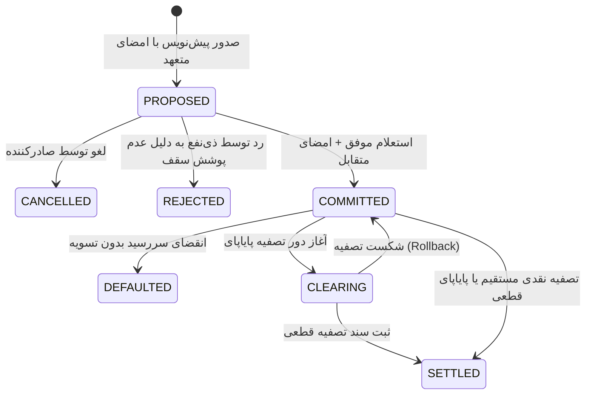

# بخش ۹: مشخصات فنی پیاده‌سازی مستقل، استاندارد RFC و راهنمای جامع انطباق نودها
## Independent Node Implementation RFC, Wire Conformance & Interoperability Specification

> **وضعیت سند:** استاندارد فنی مرجع (Normative Reference Specification)  
> **هدف:** ارائه مشخصات بایت‌به‌بایت، اسکیمای پیام‌ها، فرمول‌های پیش‌تصویر امضا و بردارهای آزمون رمزنگاری؛ به‌گونه‌ای که هر توسعه‌دهنده در هر زبان برنامه‌نویسی (مانند Rust, Go, Python, TypeScript, C++) بتواند مستقلاً یک نود سازگار بسازد که بدون کوچک‌ترین خطای ناهمخوانی با تمام نودهای شبکه تعامل نماید.

---

## ۱. کلیدواژه‌های هنجاری استاندارد (RFC 2119 / RFC 8174)

در سرتاسر این سند، کلمات هنجاری زیر بر اساس تعاریف استاندارد اینترنت به کار رفته‌اند:
- **«باید / الزامی است» (MUST / REQUIRED):** شرط قطعی پروتکل؛ تخطی از آن منجر به رد فریم یا شکست تعامل خواهد شد.
- **«نباید / ممنوع است» (MUST NOT / SHALL NOT):** نقض پروتکل و ایجاد خطای بحرانی در تعامل شبکه.
- **«توصیه‌شده» (SHOULD / RECOMMENDED):** پیاده‌سازی بهینه است مگر در شرایط خاص با ادله فنی.
- **«اختیاری / مجاز» (MAY / OPTIONAL):** قابلیت انتخابی بدون تاثیر منفی بر هسته شبکه.

---

## ۲. رمزنگاری و فرمت داده‌های باینری و متنی (Cryptographic Primitives)

تمام نودها **باید** از توابع و فرمت‌های رمزنگاری زیر استفاده نمایند:

| عملکرد الزامی | الگوریتم استاندارد | مشخصه مرجع IETF / FIPS |
| :--- | :--- | :--- |
| **امضای دیجیتال** | Ed25519 (PureEd25519) | RFC 8032 |
| **تابع درهم‌ساز** | SHA-256 (256-bit Digest) | RFC 6234 / FIPS 180 |
| **تبادل کلید متقارن** | X25519 Diffie-Hellman | RFC 7748 |
| **رمزنگاری احرازاصالت** | ChaCha20-Poly1305 (AEAD) | RFC 8439 |
| **سریال‌سازی متعارف** | RFC 8785 (JCS) | IETF RFC 8785 |

### ۲.۱. فرمت استاندارد کلیدها و امضاها
1. **کلید عمومی نود (`nodePubKey`):**
   - مقدار باینری ۳۲ بایت کلید عمومی Ed25519 است.
   - در پروتکل سیمی و پیام‌های JSON-RPC، **باید** به صورت رشته متنی ۶۴ کاراکتری هگزادسیمال با حروف کوچک (Lowercase Hex) کدگذاری شود.
   - برای تعامل با کاربر و آدرس‌دهی انسان‌خوان، نودها **باید** از فرمت Bech32 (با پیشوند `npub1...` مطابق با استاندارد BIP-173) پشتیبانی کنند و در زمان ارسال در وب‌سوکت آن را به Hex تبدیل نمایند.
2. **امضای دیجیتال (`signature`):**
   - مقدار باینری ۶۴ بایت خروجی الگوریتم Ed25519 است.
   - در پیام‌ها **باید** به صورت رشته متنی ۱۲۸ کاراکتری هگزادسیمال حروف کوچک ارسال گردد.
3. **هش محتوا (`hash` / `seedHash`):**
   - مقدار باینری ۳۲ بایت خروجی SHA-256 است که به صورت رشته ۶۴ کاراکتری هگزادسیمال حروف کوچک درج می‌شود.

---

## ۳. سریال‌سازی متعارف متون جهت هش و امضا (RFC 8785 Canonical JSON)

بزرگ‌ترین منشأ عدم تطابق میان پیاده‌سازی‌های مختلف یک سیستم نامتمرکز، تفاوت در نحوه تبدیل اشیاء داده‌ای به بایت (تفاوت در فاصله‌ها، ترتیب کلیدها یا نحوه نمایش اعداد اعشاری) است.

تمامی نودها برای اعتبارسنجی و تولید امضا **باید دقیقاً الگوریتم JSON Canonicalization Scheme (RFC 8785)** را اجرا کنند:


### قواعد قطعی سریال‌سازی متعارف (Canonical Rules):
1. **ترتیب کلیدها:** کلیدهای اشیاء JSON **باید** بر اساس ترتیب واحدهای کد UTF-16 به صورت صعودی و الفبایی مرتب شوند.
2. **حذف فاصله‌ها (Whitespace):** هیچ فاصله (`0x20`)، تب (`\t`) یا شکست خط (`\r` یا `\n`) نباید بین توکن‌های ساختاری (`{`, `}`, `[`, `]`, `:`, `,`) وجود داشته باشد.
3. **نمایش اعداد:** 
   - اعداد صحیح بدون اعشار (`100` نه `100.0`).
   - اعداد اعشاری دقیقاً مطابق قالب IEEE 754 ده‌دهی با کمترین رقم معنی‌دار، بدون نمادگذاری علمی در مبالغ عادی.
4. **رفتار با مقادیر خالی:**
   - فیلدهایی با مقدار `undefined` **باید** قبل از سریال‌سازی حذف شوند.
   - فیلدهایی با مقدار `null` صریح باقی می‌مانند.
5. **کدگذاری کاراکترها:** متن خروجی **باید** دقیقاً رشته باینری با کدگذاری `UTF-8` بدون BOM باشد.

---

## ۴. فرمول‌های قطعی پیش‌تصویر امضا (Canonical Signature Preimages)

هر نود پیش از امضا یا اعتبارسنجی، شیء داده‌ای را مطابق فرمول‌های زیر استانداردسازی می‌کند:

### ۴.۱. امضای احراز هویت پاکت ارتباطی (`auth.signature`)
فرستنده بسته درخواست بین‌نودی، شیء احراز هویت را طبق فرمول زیر هش و امضا می‌کند:

$$\text{Preimage} = \text{JCS}(\{ \text{"id"}: \text{id}, \text{"method"}: \text{method}, \text{"nonce"}: \text{nonce}, \text{"params"}: \text{params}, \text{"recipientPubKey"}: \text{recipientPubKey}, \text{"senderPubKey"}: \text{senderPubKey}, \text{"timestamp"}: \text{timestamp} \})$$

$$\text{Digest} = \text{SHA-256}(\text{UTF-8}(\text{Preimage}))$$
$$\text{Signature} = \text{Ed25519-Sign}(\text{PrivateKey}_{\text{sender}}, \text{Digest})$$

### ۴.۲. امضای اولیه پیشنهاد سند تعهد (`debtor_signature`)
پیش از ارسال پیشنهاد به طرف مقابل، سند تعهد فاقد امضای بستانکار است. پیش‌تصویر امضای متعهد عبارت است از:

$$\text{ClaimPreimage} = \text{JCS}(\{ \text{"amount"}: \text{amount}, \text{"claimType"}: \text{claimType}, \text{"creditorPubKey"}: \text{creditorPubKey}, \text{"debtorPubKey"}: \text{debtorPubKey}, \text{"description"}: \text{description}, \text{"documentId"}: \text{documentId}, \text{"dueTimestamp"}: \text{dueTimestamp}, \text{"seedHash"}: \text{seedHash}, \text{"termsPayload"}: \text{termsPayload}, \text{"unit"}: \text{unit} \})$$

$$\text{debtor\_signature} = \text{Ed25519-Sign}(\text{PrivateKey}_{\text{debtor}}, \text{SHA-256}(\text{ClaimPreimage}))$$

> **نکته حیاتی برای محاسبه `documentId`:**  
> مقدار `documentId` برابر با هش SHA-256 همان شیء بدون فیلد `documentId` است:  
> `documentId = "doc-" + sha256_hex(JCS(DraftWithoutIdAndSignatures)).slice(0, 32)`

### ۴.۳. امضای تایید متقابل بستانکار (`creditor_signature`)
بستانکار پس از اعتبارسنجی امضای بدهکار و استعلام اعتبار، سند نهایی را به این شیوه تایید می‌نماید:

$$\text{CounterSignPreimage} = \text{JCS}(\{ \text{"acceptedAt"}: \text{acceptedTimestamp}, \text{"debtorSignature"}: \text{debtor\_signature}, \text{"documentId"}: \text{documentId} \})$$

$$\text{creditor\_signature} = \text{Ed25519-Sign}(\text{PrivateKey}_{\text{creditor}}, \text{SHA-256}(\text{CounterSignPreimage}))$$

### ۴.۴. امضای سند ضمانت ضامن (`LocalVouch` / `StandardGuarantee`)
ضامن پیش‌تصویر زیر را امضا می‌کند:

$$\text{VouchPreimage} = \text{JCS}(\{ \text{"collateralPledged"}: \text{collateral}, \text{"createdAt"}: \text{createdAt}, \text{"guaranteedCreditLimit"}: \text{limit}, \text{"statement"}: \text{statement}, \text{"subjectPubKey"}: \text{subjectPubKey}, \text{"vouchId"}: \text{vouchId}, \text{"voucherPubKey"}: \text{voucherPubKey} \})$$

### ۴.۵. امضای سند تصفیه چندجانبه پایاپای (`MultiPartyClearingRecord`)
هر نود عضو در چرخه تصفیه پایاپای، پیش‌تصویر زیر را تایید و امضا می‌نماید:

$$\text{ClearingPreimage} = \text{JCS}(\{ \text{"clearingId"}: \text{clearingId}, \text{"cycleDocumentIds"}: \text{sortedCycleDocumentIds}, \text{"netReductionAmount"}: \text{netReductionAmount}, \text{"settledTimestamp"}: \text{settledTimestamp} \})$$

$$\text{node\_clearing\_signature} = \text{Ed25519-Sign}(\text{PrivateKey}_{\text{participant}}, \text{SHA-256}(\text{ClearingPreimage}))$$

### ۴.۶. امضای عضویت منشور حکومت دیجیتال (`PolityMembershipRecord`)
عضو جدید منشور، تعهد عضویت خود را به صورت زیر امضا می‌کند:

$$\text{MembershipPreimage} = \text{JCS}(\{ \text{"charterVersion"}: \text{charterVersion}, \text{"joinedAt"}: \text{joinedAt}, \text{"memberPubKey"}: \text{memberPubKey}, \text{"polityId"}: \text{polityId}, \text{"role"}: \text{role} \})$$

$$\text{member\_signature} = \text{Ed25519-Sign}(\text{PrivateKey}_{\text{member}}, \text{SHA-256}(\text{MembershipPreimage}))$$

---

## ۵. بردارهای آزمون رسمی برای توسعه‌دهندگان (Cryptographic Test Vectors)

هر توسعه‌دهنده در حال پیاده‌سازی نود مستقل، **باید** آزمون‌های واحد خود را با بردارهای آزمون قطعی زیر پاس کند تا از انطباق ۱۰۰٪ کتابخانه رمزنگاری و سریال‌سازی خود مطمئن شود:

### بردار آزمون ۱: جفت کلید Ed25519 و تبدیل‌ها
```json
{
  "testVectorName": "Ed25519 Keypair Representation",
  "privateKeySeedHex": "9d61b19deffd5a60ba844af492ec2cc44449c5697b326919703bac031cae7f60",
  "expectedPublicKeyHex": "d75a980182b10ab7d54bfed3c964073a0ee172f3daa62325af021a68f707511a",
  "expectedPublicKeyBech32": "npub1l4jh9c629z69k0u9v7r5a7m040c94n9y9vvg7j4g685t279s95us08569c"
}
```

### بردار آزمون ۲: سریال‌سازی متعارف JCS و هش محتوا
شیء ورودی با فاصله‌ها و ترتیب نامنظم کلیدها:
```json
{
  "unit": "ORGANIC_CREDIT",
  "amount": 450,
  "description": "فاکتور خرید تجهیزات",
  "documentId": "doc-test-001"
}
```

- **رشته خروجی JCS الزامی (بدون فاصله، مرتب‌شده بر حسب UTF-16):**
```text
{"amount":450,"description":"فاکتور خرید تجهیزات","documentId":"doc-test-001","unit":"ORGANIC_CREDIT"}
```
- **هش خروجی SHA-256 (Hex):**
```text
8b2fe901c80f68285ffcb6104dfc0817c9803366d7ad47f12e1ec73f78e47bf1
```

### بردار آزمون ۳: امضای Ed25519 معتبر بر اساس کلید بردار ۱
امضای بایت‌های رشته هش‌شده بردار ۲ با کلید خصوصی بردار ۱:
```text
Expected Signature (Hex):
4172f87a55259e88cbfeecdc33a3ce4ffca5f7a22e8bb332f14aa7c5c0cbe27fa5e64817d7b69a1ec098bbd4cfa12ef5b1e626e257b567d169ceeaec2c5f1101
```

---

## ۶. پروتکل سیمی و مدیریت کانال ارتباطی (Wire Protocol & Lifecyle)

### ۶.۱. چرخه حیات اتصال WebSocket (WSS Framing)
1. **پورت گوش‌دادن پیش‌فرض:** پورت استاندارد `8443` (TLS) یا پورت سفارشی اعلام‌شده در کارت تماس.
2. **دست‌تکانی آغازین (Initial Handshake):** به محض برقراری اتصال TCP/TLS، اتصال‌گیرنده **باید** ظرف حداکثر ۵ ثانیه پیام `node.handshake` را ارسال کند؛ در غیر این صورت اتصال از سوی سرور بسته می‌شود (`CODE: 4408 Request Timeout`).
3. **ضربان حیات (Heartbeat / Ping-Pong):**
   - طرفین در صورت سکوت کانال، هر **۳۰ ثانیه** یک بار متد `node.ping` را ارسال می‌کنند.
   - اگر پس از ارسال پینگ، پاسخی ظرف **۱۰ ثانیه** دریافت نشود، اتصال قطع تلقی شده و نود فرآیند اتصال مجدد را آغاز می‌نماید.
4. **عقب‌نشینی نمایی همراه با جیتر (Exponential Backoff with Jitter):**
   برای جلوگیری از هجوم همزمان به سرور پس از قطعی سراسری:
   $$T_{\text{reconnect}} = \min \left( 60, 2^{\text{attempt}} \right) + \text{random}(0.0, 3.0) \text{ ثانیه}$$

### ۶.۲. محافظت کامل در برابر حملات بازپخش (Replay Attack Defense)
- هر فریم ارسالی شامل `timestamp` و `nonce` درون شیء `auth` است.
- **بررسی پنجره زمانی:** گیرنده **باید** بررسی کند که:
  $$| \text{timestamp}_{\text{message}} - \text{timestamp}_{\text{system}} | \le 120,000 \text{ میلی‌ثانیه}$$
- **ردیابی نانس در حافظه (Nonce Cache):** گیرنده **باید** تمام نانس‌های دریافتی ۱۲۰ ثانیه گذشته را در یک حافظه موقت (مانند LRU Cache یا HashSet زمان‌دار) نگهداری کرده و در صورت دریافت نانس تکراری، فوراً خطای `ERR_REPLAY_NONCE (-32003)` بازگرداند.

---

## ۷. ماتریس کامل کدهای خطای JSON-RPC 2.0 (Standard Error Matrix)

در این پروتکل، کلیه خطاهای عمومی و تخصصی در بازه استانداردهای JSON-RPC 2.0 دسته‌بندی شده‌اند:

```typescript
interface JsonRpcErrorResponse {
  jsonrpc: "2.0";
  id: string | null;
  error: {
    code: number;                  // کد منفی استاندارد
    message: string;               // پیام کوتاه انگلیسی برای لاگ فنی
    data: {
      errorCode: string;           // شناسه ماشین‌خوان ثابت
      messageFa: string;           // پیام مفهوم برای نمایش به کاربر نهایی
      details?: Record<string, any>;
    };
  };
}
```

### جدول تفصیلی کدهای خطای رسمی نود:

| کد عددی | شناسه متنی ماشین‌خوان | عنوان خطا | اقدام الزامی نود دریافت‌کننده |
| :---: | :--- | :--- | :--- |
| **`-32700`** | `PARSE_ERROR` | بسته JSON ناقص یا نامعتبر است. | فریم رد شده و کانال ریست نمی‌شود. |
| **`-32600`** | `INVALID_REQUEST` | فاقد ساختار پاکت استاندارد یا شیء auth. | بازبینی کلاینت فرستنده و ارسال صحیح پاکت. |
| **`-32601`** | `METHOD_NOT_FOUND` | متد درخواستی وجود ندارد یا ماژول آن غیرفعال است. | استعلام `node.handshake` برای بررسی ماژول‌های فعال نود مقصد. |
| **`-32602`** | `INVALID_PARAMS` | پارامترهای ورودی متد با اسکیمای تعیین‌شده همخوانی ندارد. | اعتبارسنجی با اسکیما پیش از ارسال مجدد. |
| **`-32603`** | `INTERNAL_ERROR` | خطای داخلی دیتابیس یا کرش سرویس‌دهنده. | ثبت در لاگ و ارسال مجدد پس از تاخیر. |
| **`-32001`** | `ERR_INVALID_SIGNATURE` | عدم تطابق امضای Ed25519 با داده متعارف ارسالی. | انصراف فوری؛ احتمال دستکاری بسته در مسیر. |
| **`-32002`** | `ERR_TIMESTAMP_DRIFT` | اختلاف ساعت نود با ساعت جهانی بیش از ۱۲۰ ثانیه است. | همگام‌سازی ساعت سرور با پروتکل NTP. |
| **`-32003`** | `ERR_REPLAY_NONCE` | شناسه نانس قبلاً در پنجره زمانی دریافت شده است. | درخواست بازپخش بوده و باید مسدود شود. |
| **`-32004`** | `ERR_OVER_CREDIT_LIMIT` | مبلغ تعهد از سقف اعتبار تاییدشده توسط ضامنین فراتر است. | رد فاکتور نسیه یا درخواست وثیقه نقدی. |
| **`-32005`** | `ERR_INQUIRY_TIMEOUT` | نودهای ضامن ظرف مهلت مقرر به استعلام پاسخ ندادند. | معرفی ضامنین آنلاین دیگر توسط بدهکار. |
| **`-32006`** | `ERR_ACCOUNT_FROZEN` | حساب مخاطب به دلیل حکم داوری یا نکول معوق تعلیق است. | توقف هرگونه تعامل مالی با نود متخلف. |
| **`-32007`** | `ERR_UNAUTHORIZED_AGENT` | کلید فرستنده فاقد گواهی مأموریت معتبر از سوی حاکم است. | ابطال عملیات اداری/داوری مربوطه. |
| **`-32008`** | `ERR_DUPLICATE_DOCUMENT` | سندی با این `document_id` پیش‌تر ثبت قطعی شده است. | نادیده‌گرفتن عملیات تکراری. |
| **`-32009`** | `ERR_CYCLE_ABORTED` | حلقه تصفیه پایاپای به دلیل تغییر مانده یا عدم امضا شکست خورد. | آزادسازی قفل رزرو و بازگشت به وضعیت COMMITTED. |
| **`-32010`** | `ERR_INVALID_STATE_TRANSITION` | گذار وضعیت نامعتبر در ماشین حالت سند تعهد. | پایبندی به قوانین ماشین وضعیت (بخش ۸). |

---

## ۸. جدول قطعی گذارهای ماشین حالت اسناد (State Invariants & Authorization)

هر سند `AttestedClaim` دارای ماشین حالت قطعی زیر است. هر نود **باید** قبل از تغییر وضعیت یک سند در دیتابیس خود، شرط مجاز بودن گذار و امضای صادرکننده را اعتبارسنجی نماید:



### ماتریس اعتبارسنجی گذارهای وضعیت:

| گذار مجاز | وضعیت قبلی | وضعیت جدید | چه کسی مجاز به تحریک است؟ | پیش‌نیاز الزامی |
| :--- | :--- | :--- | :--- | :--- |
| **پیشنهاد سند** | *(عدم وجود)* | `PROPOSED` | بدهکار / متعهد | امضای معتبر `debtor_signature` بر هش سند. |
| **لغو پیشنهاد** | `PROPOSED` | `CANCELLED` | صرفاً متعهد سند | پیش از دریافت امضای متقابل طرف دوم. |
| **رد پیشنهاد** | `PROPOSED` | `REJECTED` | صرفاً ذی‌نفع سند | اعلام رد به دلیل ریسک، مبلغ یا عدم موافقت. |
| **قطعیت سند** | `PROPOSED` | `COMMITTED` | ذی‌نفع با امضا | ارائه امضای معتبر `creditor_signature`. |
| **قفل تصفیه** | `COMMITTED` | `CLEARING` | هماهنگ‌کننده تصفیه | تأیید عضویت در دور کشف‌شده تصفیه پایاپای. |
| **بازگشت از قفل**| `CLEARING` | `COMMITTED` | تایم‌اوت ۶۰ ثانیه نود | عدم تجمیع کلیه امضاهای دور تصفیه. |
| **تصفیه قطعی** | `COMMITTED` / `CLEARING` | `SETTLED` | طرفین یا دور تصفیه | ثبت رسید تسویه نقدی یا بسته `MultiPartyClearingRecord`. |
| **اعلام نکول** | `COMMITTED` | `DEFAULTED` | ذی‌نفع | سپری شدن موعد سررسید (`dueTimestamp < now`) و عدم تسویه. |

---

## ۹. اسکیمای پایگاه‌داده استاندارد محلی (Production SQLite Schema)

برای اطمینان از اینکه دیتابیس هر پیاده‌سازی مستقل، داده‌ها را به شکل سازگار با ابزارهای پشتیبان‌گیری و همگام‌سازی ذخیره می‌کند:

```sql
-- فعال‌سازی کلیدهای خارجی و کارایی بالا
PRAGMA foreign_keys = ON;
PRAGMA journal_mode = WAL;

-- ۱. حساب‌ها و مخاطبان تجاری
CREATE TABLE IF NOT EXISTS accounts (
    node_pubkey TEXT PRIMARY KEY CHECK(length(node_pubkey) = 64),
    alias_name TEXT NOT NULL,
    trust_score REAL NOT NULL DEFAULT 0.0 CHECK(trust_score >= 0.0),
    endorsed_credit_limit REAL NOT NULL DEFAULT 0.0 CHECK(endorsed_credit_limit >= 0.0),
    active_debt_balance REAL NOT NULL DEFAULT 0.0 CHECK(active_debt_balance >= 0.0),
    active_credit_balance REAL NOT NULL DEFAULT 0.0 CHECK(active_credit_balance >= 0.0),
    status TEXT NOT NULL CHECK(status IN ('ACTIVE', 'SUSPENDED', 'DEFAULTED')) DEFAULT 'ACTIVE',
    created_at INTEGER NOT NULL,
    updated_at INTEGER NOT NULL
);

-- ۲. اسناد اصلی تعهدات و ادعاهای حقوقی
CREATE TABLE IF NOT EXISTS attested_claims (
    document_id TEXT PRIMARY KEY,
    parent_claim_id TEXT REFERENCES attested_claims(document_id),
    claim_type TEXT NOT NULL CHECK(claim_type IN (
        'FINANCIAL_OBLIGATION',
        'ASSET_TITLE_TRANSFER',
        'AGENT_MANDATE',
        'SERVICE_CONTRACT',
        'LICENSING_PERMIT',
        'TIME_SLOT_RESERVATION',
        'QUALITY_ENDORSEMENT'
    )),
    debtor_pubkey TEXT NOT NULL REFERENCES accounts(node_pubkey),
    creditor_pubkey TEXT NOT NULL REFERENCES accounts(node_pubkey),
    amount REAL NOT NULL DEFAULT 0.0 CHECK(amount >= 0.0),
    unit TEXT NOT NULL DEFAULT 'ORGANIC_CREDIT',
    description TEXT NOT NULL,
    terms_payload_json TEXT NOT NULL DEFAULT '{}',
    due_timestamp INTEGER NOT NULL,
    status TEXT NOT NULL CHECK(status IN (
        'PROPOSED', 'COMMITTED', 'CLEARING', 'SETTLED', 'DEFAULTED', 'CANCELLED', 'REJECTED'
    )),
    debtor_signature TEXT NOT NULL CHECK(length(debtor_signature) = 128),
    creditor_signature TEXT CHECK(creditor_signature IS NULL OR length(creditor_signature) = 128),
    seed_hash TEXT NOT NULL,
    created_at INTEGER NOT NULL,
    settled_at INTEGER
);

CREATE INDEX IF NOT EXISTS idx_claims_debtor ON attested_claims(debtor_pubkey, status);
CREATE INDEX IF NOT EXISTS idx_claims_creditor ON attested_claims(creditor_pubkey, status);
CREATE INDEX IF NOT EXISTS idx_claims_due ON attested_claims(due_timestamp, status);

-- ۳. ضمانت‌های محلی و خطوط اعتبار
CREATE TABLE IF NOT EXISTS local_vouches (
    vouch_id TEXT PRIMARY KEY,
    voucher_pubkey TEXT NOT NULL REFERENCES accounts(node_pubkey),
    subject_pubkey TEXT NOT NULL REFERENCES accounts(node_pubkey),
    guaranteed_credit_limit REAL NOT NULL CHECK(guaranteed_credit_limit >= 0.0),
    collateral_pledged REAL NOT NULL DEFAULT 0.0,
    statement TEXT,
    voucher_signature TEXT NOT NULL CHECK(length(voucher_signature) = 128),
    created_at INTEGER NOT NULL
);

CREATE INDEX IF NOT EXISTS idx_vouches_subject ON local_vouches(subject_pubkey);

-- ۴. رویدادهای همگام‌سازی پس از قطعی ارتباط
CREATE TABLE IF NOT EXISTS sync_events (
    event_seq INTEGER PRIMARY KEY AUTOINCREMENT,
    event_type TEXT NOT NULL,
    entity_id TEXT NOT NULL,
    payload_json TEXT NOT NULL,
    created_at INTEGER NOT NULL
);

CREATE INDEX IF NOT EXISTS idx_sync_events_seq ON sync_events(event_seq);

-- ۵. تریگرهای خودکار صیانت از تراز دوبل حسابداری (Double-Entry Ledger Integrity)
CREATE TRIGGER IF NOT EXISTS trg_update_account_balances_on_commit
AFTER UPDATE OF status ON attested_claims
FOR EACH ROW
WHEN NEW.status = 'COMMITTED' AND OLD.status != 'COMMITTED'
BEGIN
    UPDATE accounts 
    SET active_debt_balance = active_debt_balance + NEW.amount,
        updated_at = strftime('%s', 'now') * 1000
    WHERE node_pubkey = NEW.debtor_pubkey;

    UPDATE accounts 
    SET active_credit_balance = active_credit_balance + NEW.amount,
        updated_at = strftime('%s', 'now') * 1000
    WHERE node_pubkey = NEW.creditor_pubkey;
END;

CREATE TRIGGER IF NOT EXISTS trg_update_account_balances_on_settle
BEFORE UPDATE OF status ON attested_claims
FOR EACH ROW
WHEN NEW.status = 'SETTLED' AND OLD.status IN ('COMMITTED', 'CLEARING')
BEGIN
    UPDATE accounts 
    SET active_debt_balance = MAX(0.0, active_debt_balance - NEW.amount),
        updated_at = strftime('%s', 'now') * 1000
    WHERE node_pubkey = NEW.debtor_pubkey;

    UPDATE accounts 
    SET active_credit_balance = MAX(0.0, active_credit_balance - NEW.amount),
        updated_at = strftime('%s', 'now') * 1000
    WHERE node_pubkey = NEW.creditor_pubkey;
END;
```

---

## ۱۰. چک‌لیست ۱۰ ماده‌ای انطباق نود مستقل (Node Conformance Certification Checklist)

توسعه‌دهنده‌ای که قصد انتشار یک نود جدید را دارد، **باید** صحت پیاده‌سازی خود را با گذراندن موارد زیر تصدیق نماید:

- [ ] **ماده ۱ (توابع رمزنگاری):** پاس کردن کامل بردارهای آزمون Ed25519 و تبدیل به فرمت هگزادسیمال ۶۴/۱۲۸ کاراکتری و Bech32.
- [ ] **ماده ۲ (سریال‌سازی JCS):** پاس کردن بردار آزمون RFC 8785 بدون کوچک‌ترین اختلاف در فاصله‌ها یا چینش فیلدها.
- [ ] **ماده ۳ (پیش‌تصویر امضاها):** تطابق هش و امضای پاکت WSS، سند تعهد و تاییدیه بستانکار با مشخصات بخش ۴.
- [ ] **ماده ۴ (پروتکل وب‌سوکت):** پاسخگویی به `node.handshake` و ارسال دوره‌ای `node.ping` با تایم‌اوت ۱۰ ثانیه.
- [ ] **ماده ۵ (پنجره زمانی و ضدبازپخش):** رد فوری درخواست‌هایی با انحراف زمانی بیش از ۱۲۰ ثانیه و مسدودسازی نانس‌های تکراری.
- [ ] **ماده ۶ (ماشین حالت قطعی):** اعمال قیود جدول گذار وضعیت و ممانعت از پرش وضعیت غیرمجاز اسناد.
- [ ] **ماده ۷ (پروتکل استعلام ارگانیک):** ارسال صحیح متد `inquiry.request` پیش از امضای تعهدات مالی نسیه.
- [ ] **ماده ۸ (تصفیه پایاپای ۲ فازی):** رعایت قفل ۶۰ ثانیه‌ای در وضعیت `CLEARING` و بازگشت خودکار (Rollback) در صورت شکست.
- [ ] **ماده ۹ (مدل داده‌ای کپسوله‌شده):** قرارگیری کلیه داده‌های مربوط به فروشگاه، رزرو نوبت یا قرارداد در فیلد `terms_payload_json` بدون دستکاری جداول اصلی.
- [ ] **ماده ۱۰ (پایداری و ایزولاسیون):** ذخیره‌سازی داده‌ها در دیتابیس رمزنگاری‌شده و صفرسازی امن کلیدهای خصوصی از حافظه در زمان خروج.

---

## ۱۱. راهنمای مدل‌های هوش مصنوعی برای تولید خودکار نود (AI Agent Blueprint & System Prompt)

این بخش به عنوان «راهنمای سیستم استنتاج خودکار» تدوین شده است تا مدل‌های هوش مصنوعی (مانند Gemini, Claude, GPT) بتوانند با دریافت این مشخصات، یک نسخه کامل و ۱۰۰٪ سازگار از نود را در زبان مقصد (Rust, Go, TypeScript یا Python) بدون هیچ باگ یا انحرافی کدنویسی کنند.

### ۱۱.۱. پرامپت مرجع هوش مصنوعی (Target LLM System Prompt):
```markdown
شما یک مهندس ارشد سیستم‌های توزیع‌شده و رمزنگاری هستید. وظیفه شما پیاده‌سازی کامل دیمون نود شخصی بر اساس استاندارد RFC بخش ۰۹ است:
۱. تمام بسته‌های سیمی بین‌نودی باید روی پروتکل WebSocket و قالب JSON-RPC 2.0 با پاکت امضاشده (InterNodeRequestEnvelope) باشند.
۲. سریال‌سازی قبل از محاسبه امضا و هش، الزاماً و بدون استثنا باید تابع استاندارد RFC 8785 (JCS) باشد. هیچ فاصله‌ای بین توکن‌ها مجاز نیست و کلیدها باید به ترتیب UTF-16 مرتب شوند.
۳. رمزنگاری منحصراً Ed25519 (PureEd25519) و درهم‌سازی SHA-256 است.
۴. هسته نود نباید هیچ جدول اختصاصی برای بیزینس‌ها بسازد؛ همه چیز در جدول `attested_claims` با محموله `terms_payload_json` کپسوله می‌شود.
۵. دیتابیس باید اسکیمای دقیق SQLite بخش ۹ را بدون تغییر نام ستون‌ها پیاده کند.
۶. اعتبارسنجی انحراف زمان (±۱۲۰ ثانیه) و فیلتر نانس‌های تکراری باید در لایه ورودی دیسپچر WSS اعمال شود.
```

### ۱۱.۲. درخت ماژولار توصیه‌شده برای پیاده‌سازی در زبان‌های مختلف:
```
src/
├── crypto/                  # موتور رمزنگاری Ed25519، SHA-256 و سریال‌سازی JCS
│   ├── keypair.rs/.go       # تولید کلید، تبدیل Hex و Bech32
│   ├── canonical_jcs.rs/.go # پیاده‌سازی RFC 8785
│   └── preimages.rs/.go     # فرمول‌های ریاضی پیش‌تصویر امضاها
├── storage/                 # لایه پایگاه‌داده محلی SQLite
│   ├── schema.sql           # اسکیمای رسمی و تریگرها
│   ├── account_repo.rs/.go  # دسترسی به حساب‌ها و کنترل سقف اعتبار
│   └── claim_repo.rs/.go    # ثبت، کوئری و بایگانی تعهدات
├── network/                 # لایه انتقال سیمی و وب‌سوکت
│   ├── envelope.rs/.go      # ساختار پاکت احراز هویت و بررسی نانس
│   ├── connection.rs/.go    # دست‌تکانی، ضربان حیات و عقب‌نشینی نمایی
│   └── dispatcher.rs/.go    # مسیریابی ۱۰ متد JSON-RPC 2.0
├── core/                    # ماشین حالت و فرآیندهای منطقی
│   ├── claim_fsm.rs/.go     # ماتریس گذار وضعیت قطعی
│   ├── inquiry_engine.rs    # ارسال استعلام به معرفین و اعتبارسنجی
│   └── clearing_2pc.rs      # الگوریتم کشف دور و تصفیه اتمیک
└── main.rs / main.go        # راه‌اندازی سرور، بارگذاری پیکربندی و باز کردن پورت
```

با این ساختار و رهنمودهای معنایی، هر عامل هوش مصنوعی می‌تواند به طور مستقل و قطعی، کدهای منسجم، بهینه و بدون خطای پروتکلی تولید کند که بدون وقفه با سایر نودها پیوند بخورد.
