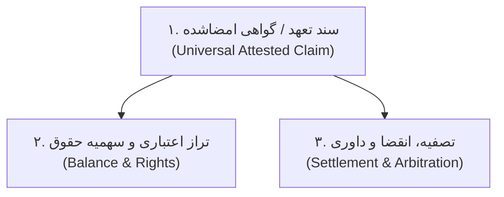
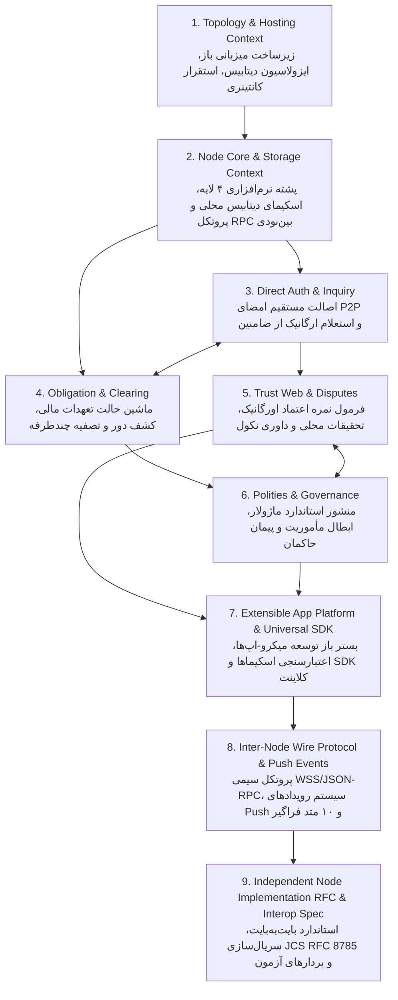
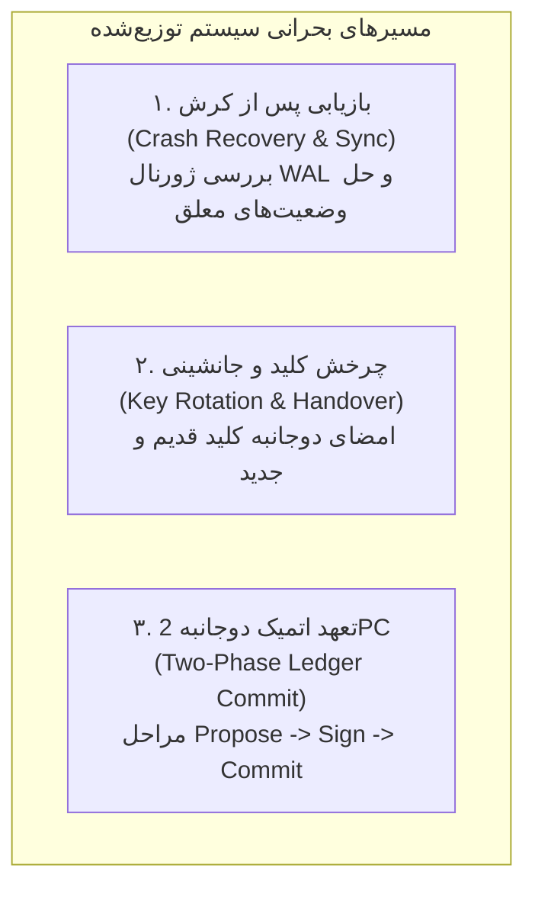

# معماری سیستم نود شخصی، اصالت مستقیم و استعلام ارگانیک (System Architecture & Organic Due Diligence)

## ۱. مانیفست معماری و مرزهای سامانه (System Boundary & Core Mission)

این مستندات، مشخصات فنی و معماری سامانه نرم‌افزاری توزیع‌شده برای **کلیه تعاملات مالی، اداری، حقوقی و حاکمیتی خودمختار** را تعریف می‌کند. در این الگو، به جای وابستگی به پلتفرم‌های انحصاری متمرکز یا بلاکچین‌های سنگین ماینینگی با کارمزدهای تصاعدی، اصل **«نود شخصی دائم‌البیدار (Online Personal Server Daemon) با اصالت مستقیم اسناد و استعلام ارگانیک اعتبار»** مبنای طراحی قرار گرفته است.

### ارکان بنیادین سیستم:
1. **نود خودمختار ۲۴/۷:** هر بازیگر (شخص حقیقی، فروشگاه یا نهاد) مالک یک نود مستقل همیشه آنلاین است که ارتباطات، حسابداری دوبل و مدیریت هویت را کنترل می‌کند.
2. **عدم خروج از نرم‌افزار شخصی:** کلیه عملیات (پیام‌رسانی، استعلام کاتالوگ، صدور تعهد، قراردادها، اسناد اداری و تصفیه) در نرم‌افزار نود شخصی پردازش شده و کاربر هرگز به پورتال‌های واسط هدایت نمی‌شود.
3. **تفکیک قطعی «اصالت سند» از «راستی‌آزمایی اعتبار»:**
   - **اصالت و قطعیت سند:** مستقیماً با امضای الکترونیک دوطرفه (`Ed25519`) تأمین می‌شود و نیازی به هیچ شاهد یا واسطه شخص ثالث ندارد.
   - **راستی‌آزمایی توان بازپرداخت و پیشگیری از تعهد کاذب:** با پروتکل استعلام ارگانیک (`peer.inquireCredit`) از ضامنین، معرفین و دفاتر عمومی طرف مقابل پیش از پذیرش سند صورت می‌گیرد.
4. **پوشش فراگیر نیازهای اداری و مالی بدون پیچیدگی:** کاهش کل فرآیندهای جهان مدرن به ۳ سنگ‌بنای تجریدی مشترک (First Principles)، بدون نیاز به افزودن زیرسیستم‌های متفرق یا قراردادهای هوشمند سنگین و آسیب‌پذیر.

---

## ۲. مثلث بنیادین سامانه فراگیر اداری-مالی (The 3 Universal Primitives)

برای پاسخ به تمامی نیازهای اداری و مالی افراد بدون تورم کد یا پیچیدگی غیرضروری (Anti-Overengineering)، هسته نود بر پایه **۳ سنگ‌بنای مستقل از دامنه (Domain-Agnostic)** بنا شده است:

1. **سند ادعا / تعهد گواهی‌شده (`AttestedClaim`):** رکورد امضاشده دوطرفه مستقیم میان صادرکننده و ذی‌نفع (فاکتور، سند مالکیت، وکالت‌نامه، قرارداد خدمت، گواهی مجوز).
2. **تراز اعتباری و سهمیه حقوق (`Balance & State`):** موتور حسابداری دوبل و دفاتر ظرفیت باز جهت ثبت مطالبات، تعهدات، سهام، اعتبار و موجودی دارایی.
3. **تصفیه، انقضا و داوری مشروط (`Settlement & Resolution`):** سازوکار بستن و اجرای اسناد (تصفیه نقدی/پایاپای، انقضای زمانی خودکار، یا صدور حکم داوری با برداشت از وثایق و صندوق‌های ضمانت).

### جدول نگاشت: پوشش امور پیچیده دنیای کنونی در ۳ مؤلفه ساده سامانه

| نیاز سنتی در جهان مدرن | فرآیند پیچیده و متمرکز فعلی | معادل آن در معماری این سامانه (بدون کد اضافی) |
| :--- | :--- | :--- |
| **بانکداری و ابزارهای اعتباری** | چک صیادی، اعتبارسنجی بانکی، کارمزد، سفته | سند تعهد مالی مستقیم (`FINANCIAL_OBLIGATION`) با استعلام ارگانیک سقف از ضامنین. |
| **دفاتر اسناد رسمی و املاک** | سازمان ثبت، استعلامات ثبتی، کاغذبازی محضری | سند انتقال مالکیت (`ASSET_TITLE_TRANSFER`) با ثبت مستقیم امضا و زنجیره واگذاری. |
| **وکالت‌نامه و تفویض اختیار** | ثبت وکالت محضری، استعلام ثنا، ریسک جعل | سند مأموریت کارگزار (`AGENT_MANDATE`) با انقضا و ابطال آنی (`CRL`). |
| **قرارداد کار و استخدام** | کارتابل کارگزینی، ثبت قرارداد، حواله پایا | سند تعهد دوره‌ای متقابل (`SERVICE_CONTRACT`) متصل به تراز هفتگی/ماهانه. |
| **صندوق بیمه و پوشش خسارت** | شرکت‌های عریض‌وطویل بیمه، ارزیابی، حق بیمه | منشور صندوق ضمانت مشترک در حکومت دیجیتال با پرداخت خسارت به آسیب‌دیدگان. |
| **پروانه کسب و مجوز فعالیت** | درگاه‌های متمرکز دولتی، بروکراسی امضا | سند گواهی صلاحیت (`LICENSING_PERMIT`) صادرشده توسط حکومت صنفی برای کلید عمومی. |
| **صرافی ارز و تبدیل دارایی** | صرافی‌های متمرکز، کارمزد مبادله، استخرهای AMM | تبدیل واحد سنجش تعهد (`OBLIGATION_UNIT_SWAP`) با معاوضه مستقیم اسناد تعهد با دو واحد مختلف. |
| **تنزیل مطالبات و تسویه زنجیره‌ای** | تنزیل برات، فاکتورینگ بانکی، بازار ثانویه بدهی | انتقال و پذیرش تعهد (`CLAIM_NOVATION`) توسط واسطه‌های اعتباری با کارمزد توافقی. |
| **رزرو نوبت پزشک و رستوران** | پلتفرم‌های رزرو متمرکز، کارمزد نوبت، ابطال یکطرفه | سند تعهد بازه زمانی (`TIME_SLOT_RESERVATION`) با ضمانت حضور متقابل و وجه التزام شفاف. |
| **تبلیغات تجسسی و نظرات فیک** | پلتفرم‌های انحصاری ادز، رتبه‌بندی‌های تقلبی، سئو | گواهی کیفیت امضاشده (`QUALITY_ENDORSEMENT`) با کشف ارگانیک و دهان‌به‌دهان در گراف معتمدین. |
| **رزومه کاری و پیشینه شغلی** | رزومه‌های کاغذی/لینکدین مستعد جعل، استعلام خسته‌کننده | بسته رزومه اعتباری گواهی‌شده (`REPUTATION_RESUME_BUNDLE`) با راستی‌آزمایی آنی امضاهای دیجیتال پیشین. |
| **لیست سیاه و سوابق کلاهبرداری** | سیستم‌های متمرکز سوءپیشینه، چک برگشتی بانک مرکزی | نودهای دیده‌بان و گزارش سیاه (`SENTINEL_REPORT_NODES`) با گزارش‌های امضاشده و استعلام سریع. |

---

## ۳. واژگان فراگیر سامانه (Ubiquitous Language)

| واژه استاندارد (Domain Term) | شناسه فنی (Code Identifier) | تعریف دقیق دامنه |
| :--- | :--- | :--- |
| **نود شخصی** | `PersonalNode` | سرور ۲۴/۷ دائم‌البیدار مستقل کاربر با کلید اختصاصی Ed25519 و پایگاه‌داده محلی. |
| **سند تعهد مالی مستقیم** | `DebtObligation` | رکورد بدهکار/بستانکار دارای امضای دیجیتال معتبر طرفین شامل مبلغ، واحد و سررسید. |
| **رزرو تعهد زمانی** | `TimeSlotReservation` | سند تعهد دوجانبه برای اختصاص بازه زمانی معین (پزشک، مشاوره، رستوران) با ضمانت التزام. |
| **توصیه ارگانیک کیفیت** | `QualityEndorsement` | گواهی رضایت و تایید کیفیت امضاشده توسط مشتری برای کشف غیرقابل‌جعل خدمات در حلقه معتمدین. |
| **رزومه اعتباری گواهی‌شده** | `ReputationResumeBundle` | بسته تجمیعی تاییدیه‌های امضاشده توسط کارفرمایان، مشتریان و حاکمان قبلی جهت راستی‌آزمایی آنی نزد نودهای ناآشنا. |
| **نود گزارش و دیده‌بان** | `SentinelReportNode` | نود گردآورنده گزارش‌های سیاه و تخلفات امضاشده جهت پاسخگویی به استعلام سوابق منفی کاربران شبکه. |
| **سند گزارش سیاه** | `BlackReportRecord` | رکورد رسمی شکایت و نقض عهد با امضای دیجیتال شاکی و ارجاع به سند تعهد نقض‌شده. |
| **استعلام ارگانیک اعتبار** | `PeerCreditInquiry` | درخواست استعلام ظرفیت و خوش‌حسابی ارسال‌شده به نودهای معرف و ضامنین مخاطب. |
| **تاییدیه و ضمانت محلی** | `LocalVouch` | سند ضمانت رسمی با امضای معرف شامل سقف اعتبار تضمین‌شده و قبول مسئولیت مشترک. |
| **ضمانت استاندارد شفاف** | `StandardGuarantee` | سند ضمانت با شرایط شفاف در ۳ فرمت آماده (تضامنی، درصدی، یا مشروط به حکم). |
| **مجوز استعلام مشروط** | `InquiryGrant` | سند امضاشده توسط صاحب حساب برای اعطای حق استعلام موضوعی و زمان‌دار جهت حفظ حریم خصوصی. |
| **گواهی تابعیت و هویت** | `CitizenshipCertificate` | سند هویت صادرشده توسط حاکم که متضمن احراز هویت و پذیرش صلاحیت رسیدگی به شکایات است. |
| **سقف تعهد باز** | `OpenCreditLimit` | حداکثر مجموع تعهدات معوق مجاز برای یک نود بر اساس ضمانت ضامنین و خطوط وثیقه. |
| **تصفیه پایاپای حلقوی** | `CircularClearing` | الگوریتم تهاتر خودکار چندطرفه جهت صفر یا کمینه‌سازی بدهی‌ها بدون نیاز به نقدینگی. |
| **واسطه رسوب‌زدایی تعهد** | `ObligationIntermediary` | نود تسهیل‌گر که با کشف تلاقی‌ها میان بخش‌های ناآگاه شبکه، تعهدات رسوب‌کرده را با پذیرش، انتقال یا تبدیل تسویه می‌سازد. |
| **انتقال و جایگزینی تعهد** | `ClaimNovation` | سند انتقال طلب به بستانکار جدید یا تقبل تعهد بدهکار توسط واسطه معتبر با امضای طرفین. |
| **معاوضه واحد سنجش تعهد** | `ObligationUnitSwap` | معاوضه متقابل دو سند تعهد با دو واحد مختلف (معادل تبدیل ارز و دارایی بدون جابجایی پول فیزیکی). |
| **حکومت دیجیتال** | `DigitalPolity` | تشکل خودمختار اختیاری با منشور استاندارد ماژولار و کارگزاران اجرایی تعیین‌شده. |
| **کارگزار منشور** | `CharterAgent` | نود تخصصی دارای مأموریت رسمی از سوی حاکم (مانند کارگزار داوری یا خزانه‌داری). |
| **کارت تماس نود** | `PeerContactCard` | شیء امضاشده حاوی کلید عمومی ثابت، نام نمایشی و راه‌های دسترسی چندگانه جهت معرفی بدون وابستگی به IP. |
| **اعلامیه نشانی و ضربان** | `EndpointAnnouncement` | سند امضاشده توسط نود برای اعلام تغییر IP یا سرور به شبکه همتایان جهت حل پویای آدرس. |

---

## ۴. نقشه دامنه‌های محدود (Bounded Contexts Map)

سامانه بر اساس تفکیک دامنه‌های کسب‌وکار به ۹ حوزه مستقل با رابط‌های مشخص (Contracts) سازمان‌دهی شده است:

---

## ۵. فهرست و ساختار مشخصات فنی (Specification Index)

اسناد معماری در ۹ بخش استاندارد و تفکیک‌شده تدوین شده‌اند:

1. **[`01-architecture-overview.md`](./01-architecture-overview.md): نمای کلی معماری، توپولوژی نودها و مدل میزبانی باز**
   - توپولوژی فیزیکی و منطقی، جداسازی لایه میزبانی، موتور فراگیر اداری-مالی، مقیاس‌پذیری منابع و محو مسئله کلان‌داده با شاردینگ طبیعی.
2. **[`02-node-structure-and-storage.md`](./02-node-structure-and-storage.md): ساختار نرم‌افزار نود، مدل داده و ذخیره‌سازی محلی**
   - پشته نرم‌افزاری ۴ لایه، اسکیمای جامع SQLite، قراردادهای JSON-RPC همتا و کاتالوگ کدهای خطا.
3. **[`03-witness-consensus-and-credit.md`](./03-witness-consensus-and-credit.md): اصالت مستقیم اسناد و پروتکل استعلام ارگانیک اعتبار**
   - تفکیک اصالت سند از راستی‌آزمایی اعتبار، امضای مستقیم P2P، پروتکل استعلام ارگانیک از ضامنین و تصمیم‌گیری مستقل بستانکار.
4. **[`04-transaction-lifecycle-and-clearing.md`](./04-transaction-lifecycle-and-clearing.md): چرخه حیات تعهدات مالی، قراردادها و الگوریتم تصفیه پایاپای**
   - ماشین حالت رسمی اسناد و تعهدات، الگوریتم کشف دور بدهی، پروتکل اتمیک تصفیه چندطرفه، الگوهای فراگیر تعاملات و رزومه اعتباری رمزمحور.
5. **[`05-trust-web-and-dispute-resolution.md`](./05-trust-web-and-dispute-resolution.md): وب اعتماد محلی، ضمانت مشترک و حل‌وفصل دعاوی**
   - الگوریتم امتیازدهی اعتبار، مسئولیت تضامنی معرفین، بسته شواهد رمزنگاری‌شده، فرآیند دادرسی نکول و نودهای دیده‌بان گزارش سیاه.
6. **[`06-digital-polities-and-governance.md`](./06-digital-polities-and-governance.md): ساختار حکومت‌های دیجیتال، کارگزاران و پیمان‌های حاکمیتی**
   - الحاق و لغو تابعیت اختیاری، مشخصات ماشین‌خوان منشور، گواهی ابطال مأموریت کارگزاران، جانشینی کلید و ماتریس ۴ سطحی معاهدات بین‌حاکمیتی.
7. **[`07-extensible-app-platform-and-sdk.md`](./07-extensible-app-platform-and-sdk.md): بستر باز توسعه خدمات، معماری میکرو‌-اپ و جعبه‌ابزار توسعه**
   - اصل هسته نابینا به بیزینس، پشته ۴ لایه افزونه‌ها، جعبه‌ابزار ۴ متدی `@universal-node/sdk`، اسکیماهای فروشگاه، نوبت‌دهی و کشف خودکار قابلیت‌ها.
8. **[`08-inter-node-api-and-wire-protocol.md`](./08-inter-node-api-and-wire-protocol.md): پروتکل سیمی، رابط‌های API و سیستم نوتیفیکیشن بلادرنگ بین نودها**
   - پروتکل استاندارد WSS/JSON-RPC 2.0، پاکت احراز هویت با امضای دیجیتال، معماری پایگاه‌کد واحد با ماژول‌های فعال‌پذیر، فهرست ۱۰ متد فراگیر API، رویدادهای Push و محافظت ضد بازپخش (Anti-Replay).
9. **[`09-developer-rfc-and-interop-spec.md`](./09-developer-rfc-and-interop-spec.md): مشخصات فنی پیاده‌سازی مستقل، استاندارد RFC و راهنمای جامع انطباق نودها**
   - قواعد سریال‌سازی متعارف RFC 8785 (JCS)، فرمول‌های قطعی پیش‌تصویر امضا، بردارهای آزمون رمزنگاری، کاتالوگ خطاهای منفی JSON-RPC، اسکیمای پروداکشن SQLite و چک‌لیست ۱۰ ماده‌ای انطباق نودهای مستقل.

---

## ۶. ماتریس مهندسی عملگرایانه، پالایش دامنه‌ها و رفع نقاط کور بحرانی (Pragmatic Architecture & Critical Paths)

### ۶.۱. اصول سه‌گانه پالایش معماری (The Pragmatic Triad)
1. **توازن در عمق مستندات (No Fluff):** حذف کامل ادعاهای تئوریک، مقایسه‌های دانشگاهی با مکاتب فلسفی و کلی‌گویی‌های بازاریابی؛ تمرکز ۱۰۰٪ روی منطق قطعی، ماشین حالت، کدهای خطا و پیش‌تصویرهای امضا.
2. **پرهیز از بیش‌مهندسی (Anti-Overengineering):** جایگزینی سامانه‌های توکن‌محور، قراردادهای هوشمند سنگین چندسطحی و ساختارهای دیوان‌سالارانه رای‌گیری با ۳ مؤلفه مستقل بنیادین: `AttestedClaim`، `BalanceLedger` و `SettlementEngine`.
3. **مشخصه‌سازی قطعی نقاط شکست (Deterministic Failure Handling):** تعریف دقیق تمامی حالات خطای شبکه‌ای، مسدودسازی بازپخش و خطاهای سررسید با کدهای منفی استاندارد JSON-RPC.

---

### ۶.۲. پالایش دامنه‌ها و حذف انتزاعات کم‌ارزش (Pruned Abstractions vs. Core Primitives)

| مؤلفه سنتی / انتزاع بیش‌طراحی‌شده | علت حذف یا پالایش | جایگزین عملگرایانه با کارایی بالا |
| :--- | :--- | :--- |
| **قراردادهای هوشمند ماشین تورینگ کامل (EVM/WASM VM)** | ریسک بالای باگ امنیتی، کارمزد تصاعدی و سنگینی سرور | اسکیماهای اعتبارسنجی سبک کلاینتی (`JSON Schema Draft 2020-12`) بدون تغییر دیمون نود. |
| **استخرهای توکن واسط و کوین‌های بومی شبکه (Native Coins)** | نوسان سفته‌بازانه، اصطکاک مالی و ریسک‌های مقرراتی | تعهدات بدهکار/بستانکار مستقیم دوجانبه با واحدهای حسابداری پایدار (`IRR`, `USD`, `HOUR`, `GRAM_GOLD`). |
| **سیستم‌های رای‌گیری چندسطحی پیچیده DAO** | کندی تصمیم‌گیری، تبانی کارتل‌ها و بار پردازشی بیهوده | منشور ماژولار و کارگزاران اجرایی مستقیم با احکام صریح و لغو آنی مأموریت (`AGENT_MANDATE_REVOKED`). |
| **توکن‌های غیرمثلی (NFT) برای اسناد اداری** | وابستگی به زنجیره جهانی و افشای حریم خصوصی | رکوردهای تعهد امضاشده مستقیم (`ASSET_TITLE_TRANSFER`) در پایگاه‌داده محلی SQLite. |

---

### ۶.۳. تکمیل ۴ مسیر بحرانی حیاتی (Engineered Critical Paths)

1. **بازیابی حالت نود پس از قطعی یا خرابی ناگهانی (Crash Recovery & State Reconciliation):**
   - به محض اجرای دیمون نود، موتور ذخیره‌سازی ژورنال `WAL` پایگاه‌داده SQLite را بررسی و تعهدات وضعیت `PROPOSED` که زمان انقضای آن‌ها سپری شده را به صورت خودکار به `REJECTED` تغییر وضعیت می‌دهد.
   - برای تعهدات در وضعیت `CLEARING`، نود وضعیت چرخه را از نودهای همتا استعلام و در صورت عدم تکمیل در بازه ۳۰۰ ثانیه، قفل وجوه را لغو (`Rollback`) می‌کند.

2. **مدیریت چرخه حیات کلید و اعلام کلید جانشین (Key Succession & Handover):**
   - هر نود دارای امکان معرفی یک کلید پشتیبان (`successorPubKey`) است. در صورت به سرقت رفتن یا سوختن سخت‌افزار نود، سندی تحت عنوان `KeyRevocationNotice` با امضای مشترک کلید قبلی و کلید جدید به ضامنین و حکومت‌های عضو ارسال و تمامی تعهدات معوق به کلید جدید منتقل می‌شوند.

3. **پروتکل تعهد اتمیک دوجانبه (Two-Phase Bilateral Commitment - 2PC):**
   - برای جلوگیری از ناهماهنگی ترازنامه طرفین، ثبت هر بدهی مستلزم عبور از گام‌های سه‌گانه `claim.propose` (پیشنهاد) $\rightarrow$ `claim.sign` (امضای متقابل) $\rightarrow$ `claim.commit` (تثبیت در دفتر دوبل) است؛ در صورت بروز قطعی شبکه پیش از مرحله سوم، سند فاقد اعتبار اجرایی تلقی شده و تراز دست‌نخورده باقی می‌ماند.

4. **فرآیند رفع تعلیق، بازپرداخت نکول و بازگشت به وضعیت عادی (Post-Default Remediation):**
   - چنانچه نودی به دلیل نکول بدهی در لیست سیاه نودهای دیده‌بان قرار گیرد، با صدور سند `RemediationSettlement` و پرداخت مبلغ مورد اختلاف به همراه خسارت تعیین‌شده توسط داور، شاکی موظف است سند `BlackReportRevocation` را امضا کند. نود دیده‌بان با دریافت این لغو امضاشده، وضعیت نود را ظرف حداکثر ۵ دقیقه به حالت فعال (`ACTIVE`) بازمی‌گرداند.

